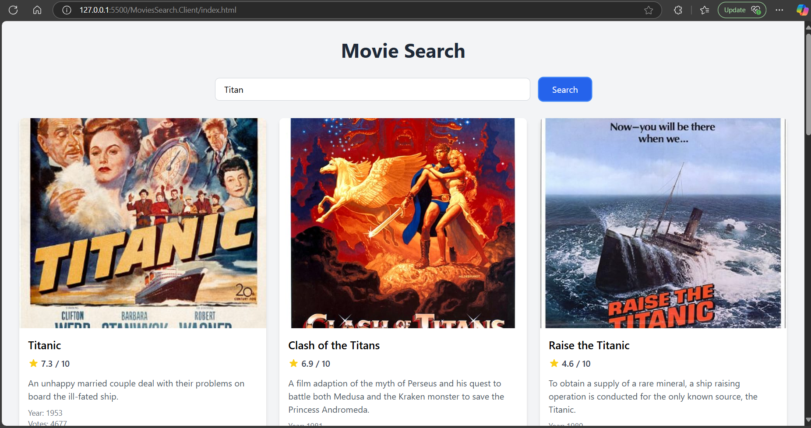
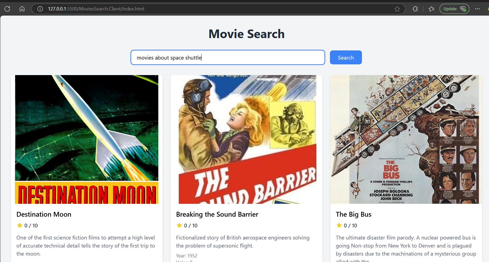
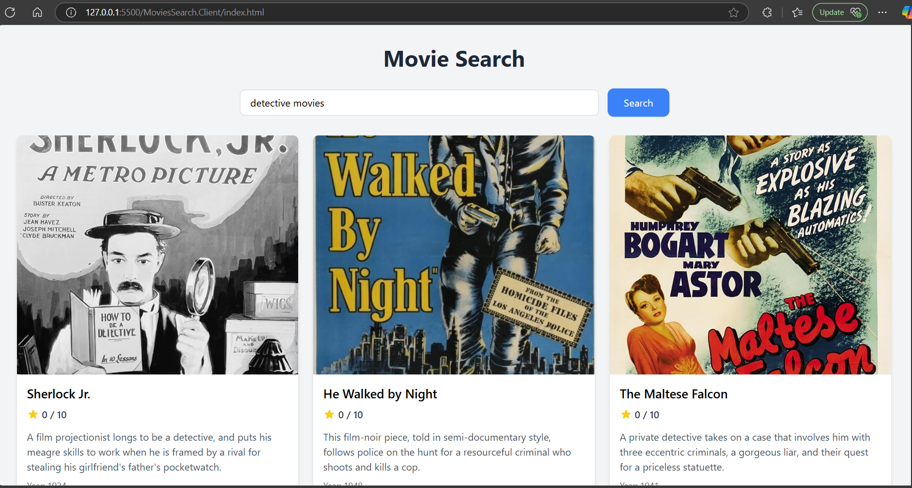

# MongoDB Vector Search Demo

This project demonstrates semantic search capabilities using MongoDB's vector search functionality, comparing traditional keyword-based search versus vector-based semantic search for movie data.

## Features

- Vector-based semantic search using MongoDB Atlas
- Traditional keyword-based search implementation
- Movie data management with plot embeddings
- Background service for generating embeddings
- Integration with OpenAI's embedding model

## Search Comparisons

### Traditional Keyword Search
Traditional keyword search performs exact matching on movie plots:

### Vector-Based Semantic Search
Semantic search understands context and meaning, providing more relevant results:

## Technical Implementation

- **MongoDB Atlas**: Used as the vector database
- **Background Processing**: Automatic embedding generation for movie plots
- **Vector Search**: Implemented using MongoDB's vector search capabilities
- **.NET Core**: Built using .NET Core with dependency injection
- **OpenAI Integration**: Utilizes OpenAI's embedding model for vector generation

## Architecture

- `MovieEmbeddingGenerator`: Background service that generates embeddings for movie plots
- `MovieService`: Handles movie data operations and search functionality
- `IEmbeddingGenerator`: Interface for vector embedding generation
- `MongoDB Integration`: Direct integration with MongoDB Atlas for vector search

## Benefits of Vector Search

- More contextually relevant search results
- Understanding of semantic meaning
- Ability to find related content even with different keywords
- Better handling of natural language queries
