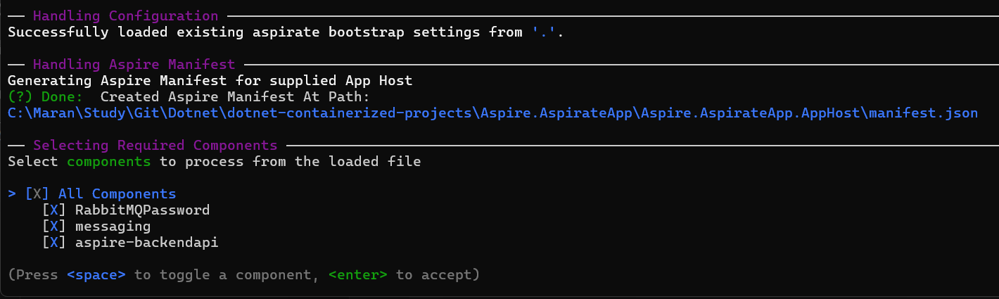
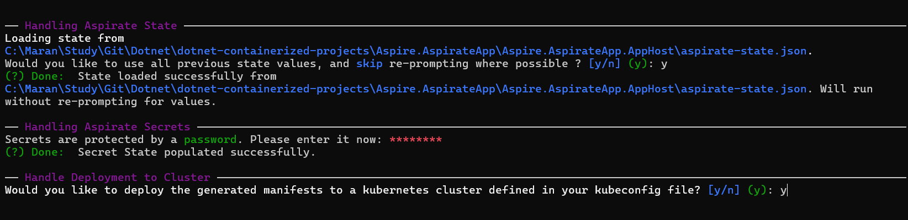
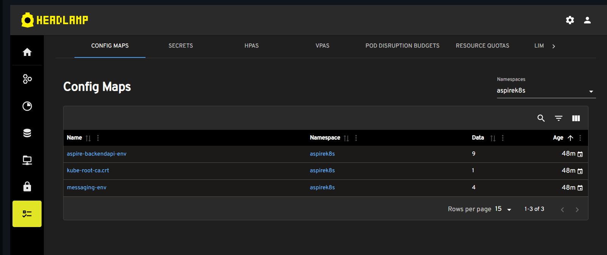

### Installing .Net Aspir8
```bash
> dotnet tool install -g aspirate --prerelease
```
If it is already installed installed, you can do the update.
```bash
> dotnet tool update -g aspirate --prerelease
```
## Aspirate operations


### Initialize the aspirate


- Set docker.io for container registry fallback value
- Set the username of your docker hub registry value.

- After setting the configuration, the init command will create a json file in the AppHost project. Here the file is aspirate.json

```json
    {
  "TemplatePath": null,
  "ContainerSettings": {
    "Registry": "docker.io",
    "RepositoryPrefix": "rmanimaran",
    "Tags": [
      "latest"
    ],
    "Builder": "docker"
  }
}
```
## Build the Images
- Run the command `aspirate generate` to build the images and create the Kubernetes manifest files for the projects (Api and RabbitMQ)
- Enter the password for the secrets in the kubernetes

 

 

 

 - confirm Y to install the aspire dashboard
 

 

 


## Check the Kubernetes Environment


## Deploy the application
- Run the command `aspirate apply` to apply and deploy the generated manifests to a Kubernetes cluster.





## Deployed application in docker


## Access the application


- port forward Dashboard


- port forward messaging


## Kubernetes 




## Destroy the deployed application
 - Apply the `aspirate destroy` to destroy and remove the resources


