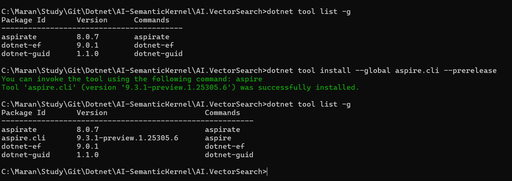
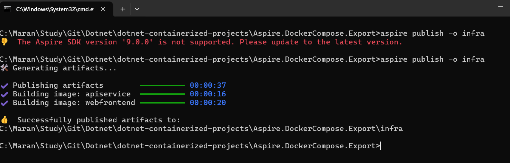
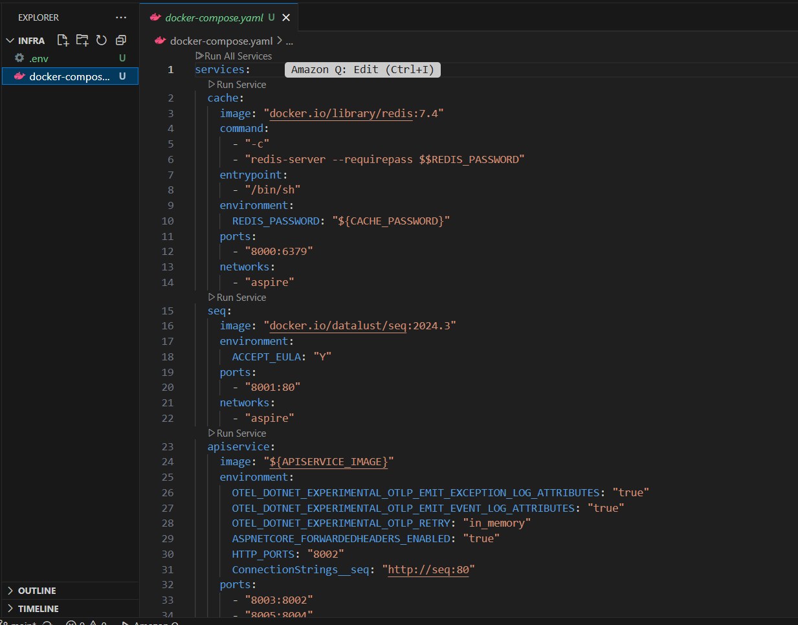
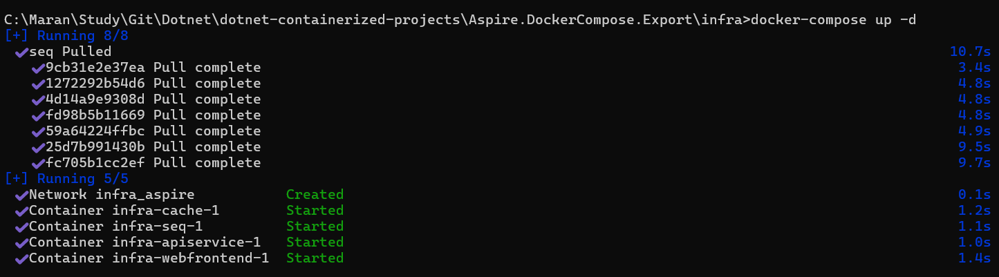
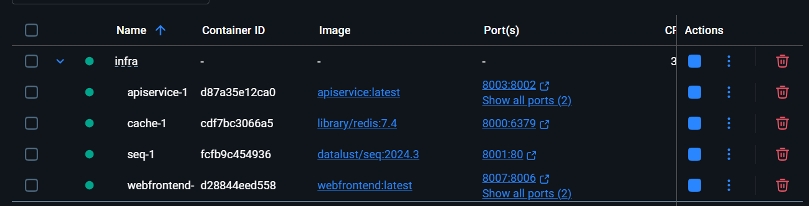

# .NET Aspire Docker Compose Export

This project demonstrates how to export a .NET Aspire application to Docker Compose format for deployment in non-cloud environments. It showcases the ability to run Aspire applications without requiring cloud infrastructure, making it suitable for on-premises deployments, development environments, or scenarios where cloud services are not available.

## Project Overview

The solution includes:
- **Web Frontend** - Blazor application with Redis caching
- **API Service** - Web API with health checks
- **Redis Cache** - For distributed caching
- **Seq** - Centralized logging and distributed tracing

## Key Features

- **Non-Cloud Deployment**: Deploy Aspire applications without cloud dependencies
- **Distributed Tracing**: Integrated Seq for viewing application traces and logs
- **Service Discovery**: Automatic service-to-service communication
- **Health Checks**: Built-in health monitoring for all services
- **Redis Caching**: Distributed caching with Redis

## Prerequisites

- .NET 9.0 SDK
- Docker Desktop
- Aspire CLI

## Setup Instructions

### 1. Install Aspire CLI

```bash
dotnet tool install -g Aspire.Cli
```




### 2. Export to Docker Compose

```bash
aspire publish -o infra
```

This command generates Docker Compose files in the `infra` folder.



### 3. Run the Application

```bash
cd infra
docker-compose up -d
```




## Service Endpoints

- **Web Frontend**: http://localhost:8007
- **API Service**: http://localhost:8003
- **Seq Dashboard**: http://localhost:8001
- **Redis**: localhost:8000

## Distributed Tracing with Seq

Seq is integrated to provide centralized logging and distributed tracing capabilities:

- **Automatic Trace Collection**: All HTTP requests and service calls are automatically traced
- **Structured Logging**: Application logs are centrally collected and searchable
- **Performance Monitoring**: View request timings and identify bottlenecks
- **Error Tracking**: Centralized error logging and exception tracking

### Accessing Seq Dashboard

1. Navigate to http://localhost:8001
2. View real-time logs and traces
3. Use filters to search specific services or time ranges
4. Analyze request flows across services

## Benefits of Docker Compose Deployment

- **Simplified Deployment**: Single command deployment without cloud complexity
- **Cost Effective**: No cloud service costs for development/testing
- **Offline Capability**: Works without internet connectivity
- **Environment Consistency**: Same configuration across dev, test, and production
- **Easy Scaling**: Modify docker-compose.yaml to scale services

## Project Structure

```
├── Aspire.DockerCompose.Export.AppHost/     # Aspire orchestration
├── Aspire.DockerCompose.Export.ApiService/  # Web API service
├── Aspire.DockerCompose.Export.Web/         # Blazor frontend
├── Aspire.DockerCompose.Export.ServiceDefaults/ # Shared configurations
└── infra/                                   # Generated Docker Compose files
    ├── docker-compose.yaml
    └── .env
```

## Monitoring and Observability

The application includes comprehensive observability features:

- **OpenTelemetry Integration**: Automatic metrics and tracing
- **Health Checks**: `/health` endpoints for all services
- **Structured Logging**: JSON formatted logs sent to Seq
- **Distributed Tracing**: End-to-end request tracking
- **Performance Metrics**: Response times and error rates

