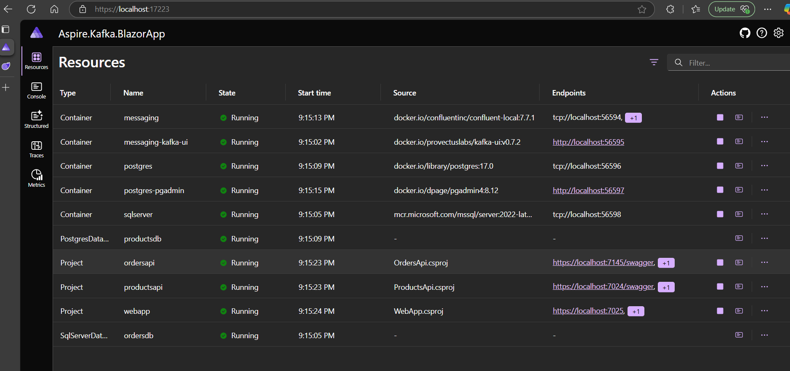
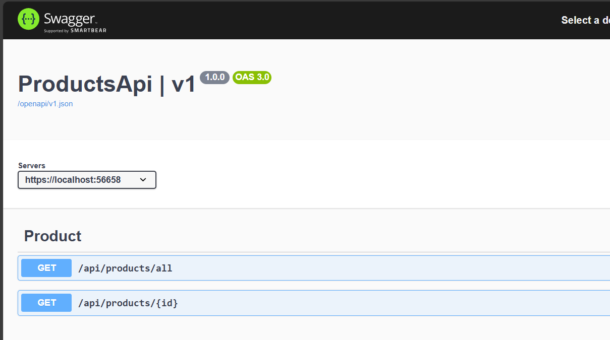
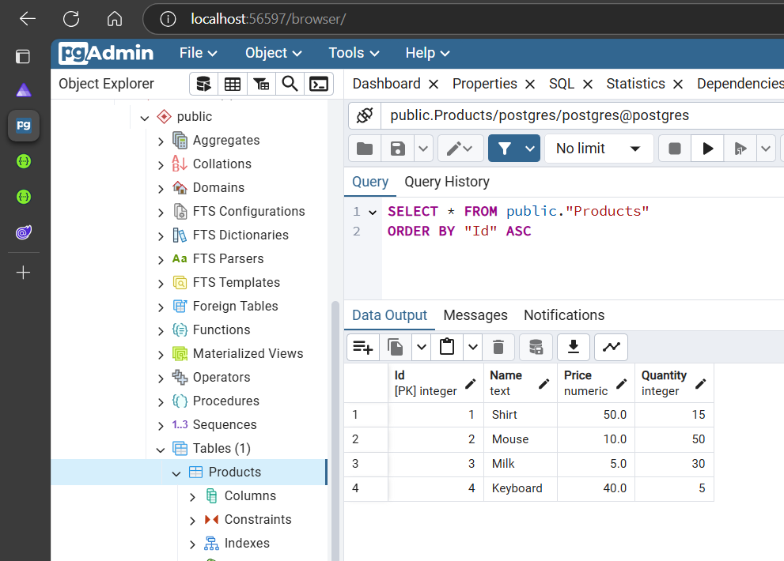
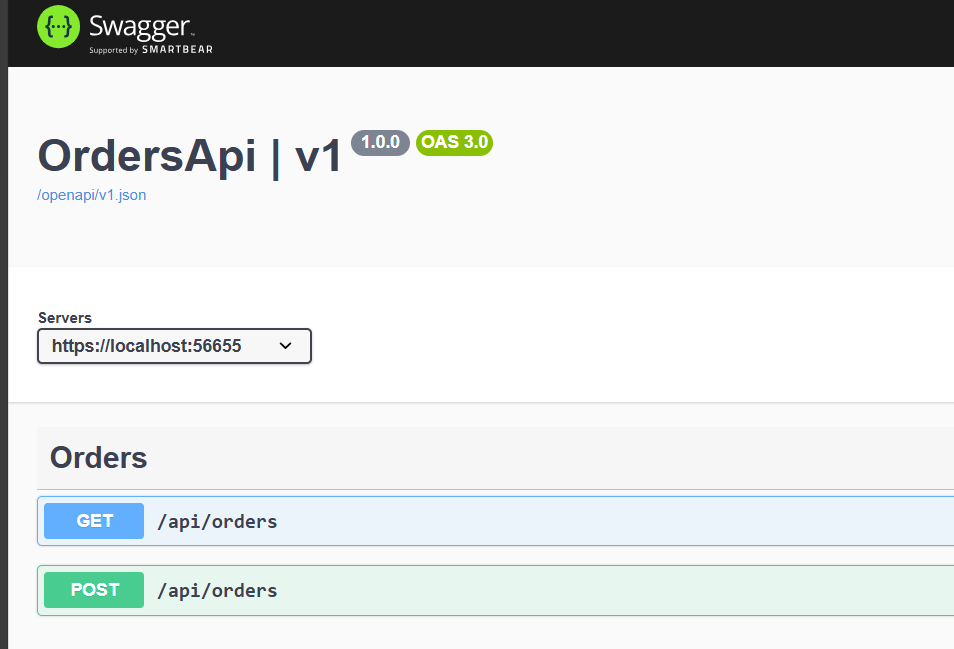
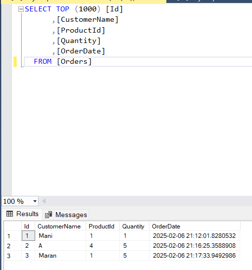
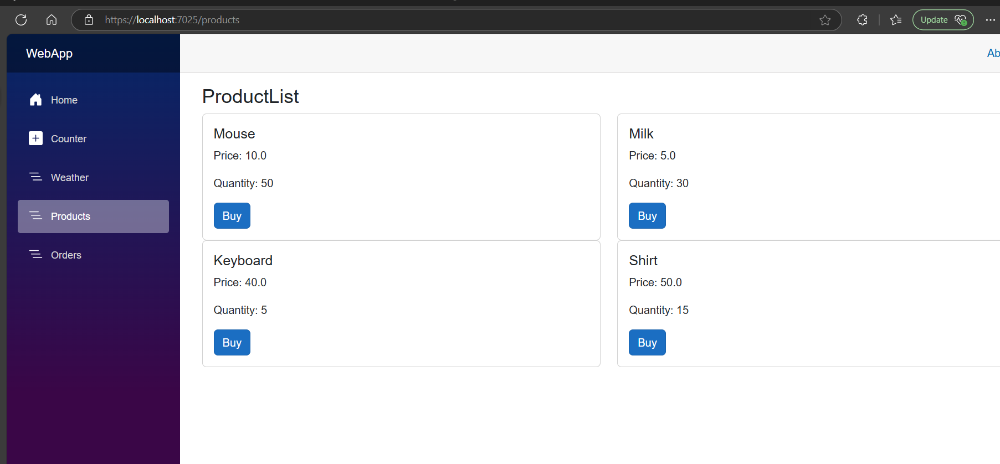
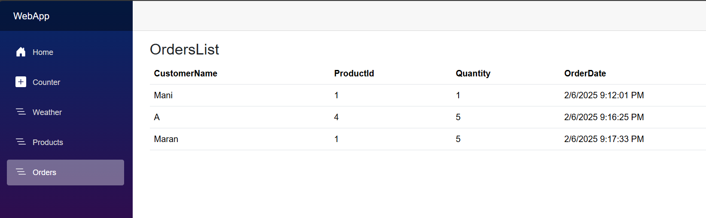
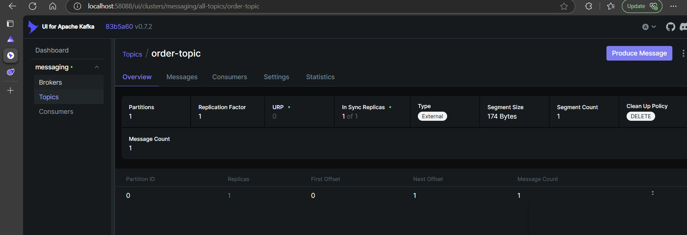
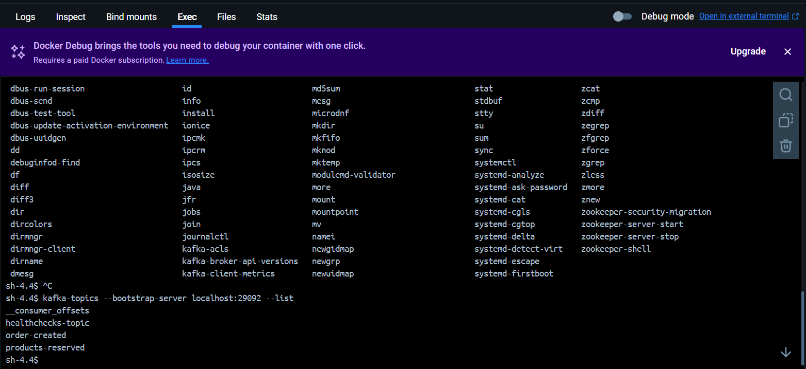
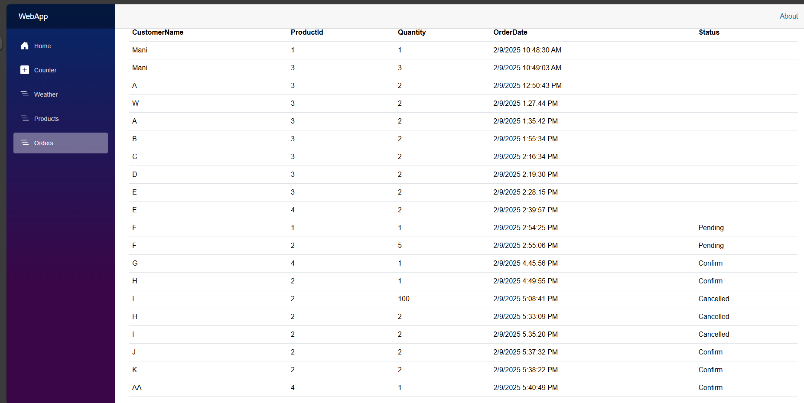

# SAGA Pattern Using Kafka and .Net Aspire

Architecture:
s

## Aspire Dashboard

## Products Api Endpoints & Postgresql database

## Orders Api Endpoints & Sqlserver database

## Products display in the Blazor app

## Orders List after placing orders

## Kafka Topics view. 

# Kafka Topics in docker Terminal using command
> First provide cd /bin and then run the ls to list the files

