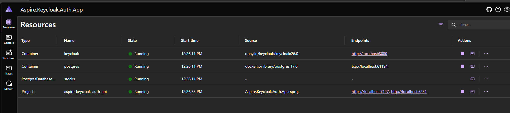
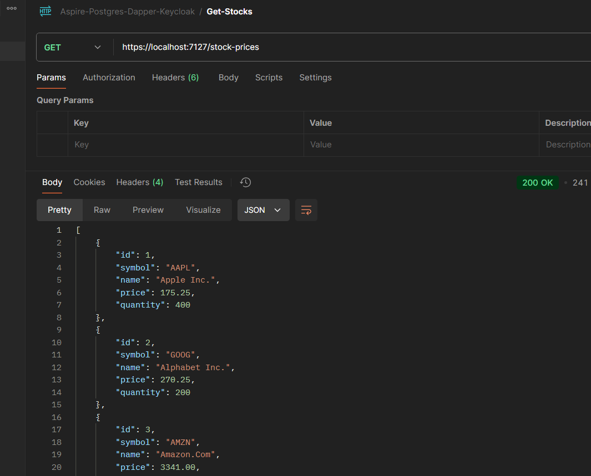
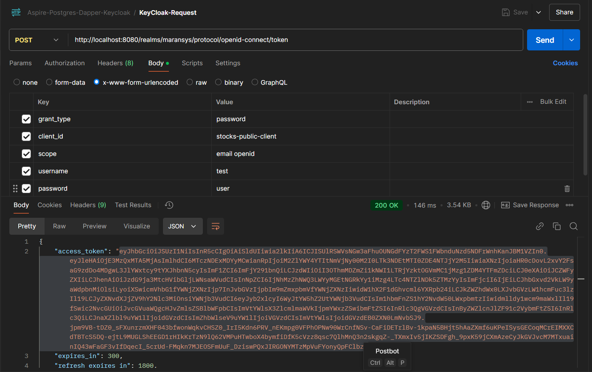
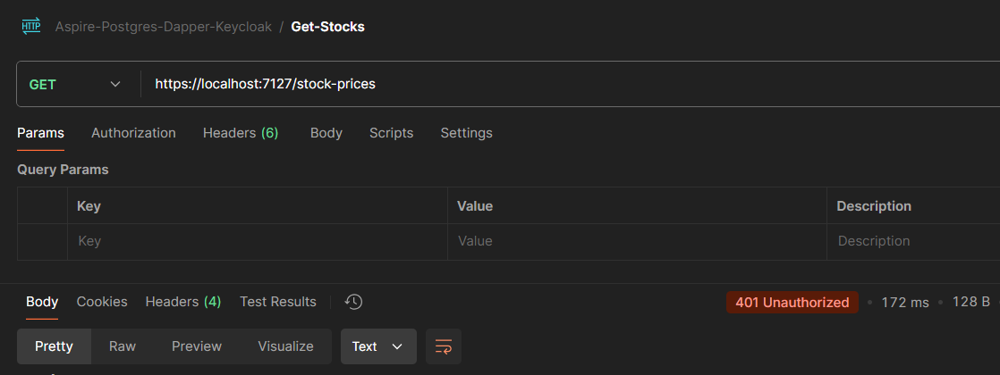
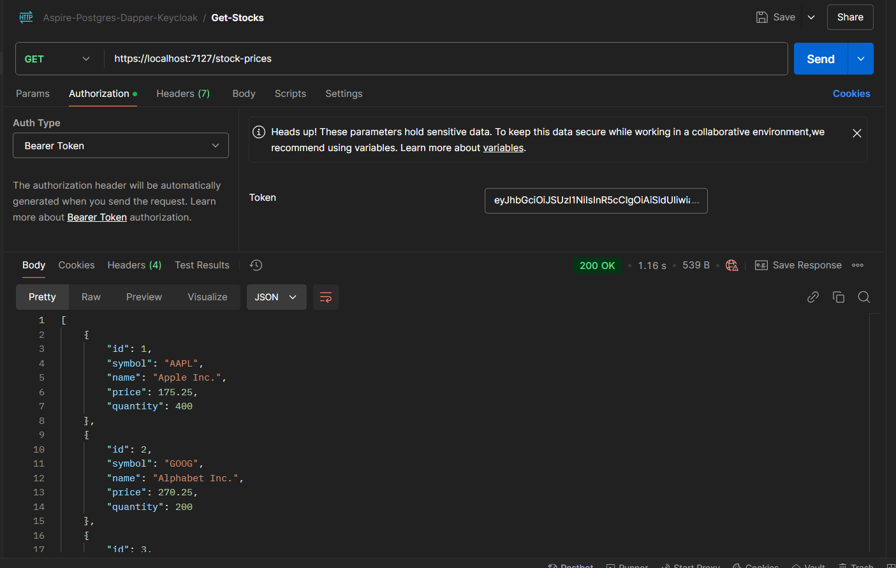
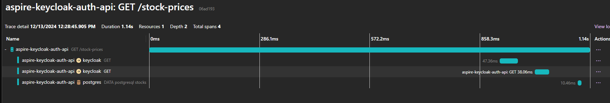

## Running KeyCloak in .Net Aspire and Authenticate Web API endpoints with Postgres database

## KeyCloak Running in .Net Aspire as Container

## Added Postgres using Aspire as Container with stocks as the database.

* Login in to Keycloak and created a realm named maransys
* Added a client and some test users with credentials.

## Running the endpoint without Authentication enabled

Get the access and Refresh token from Keycloak using postman

## Call API endpoint without Authorization Token

- Now pass the access token which we got from the Keycloak to the request.

## Traces in .Net Aspire

