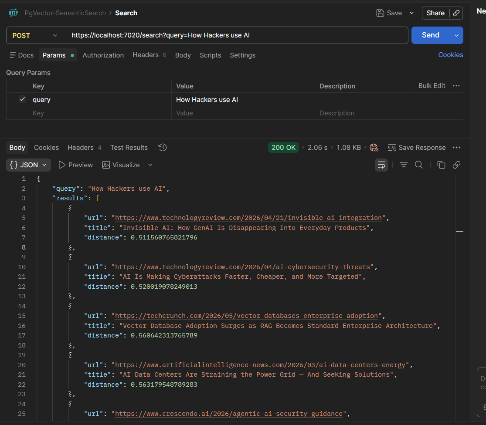
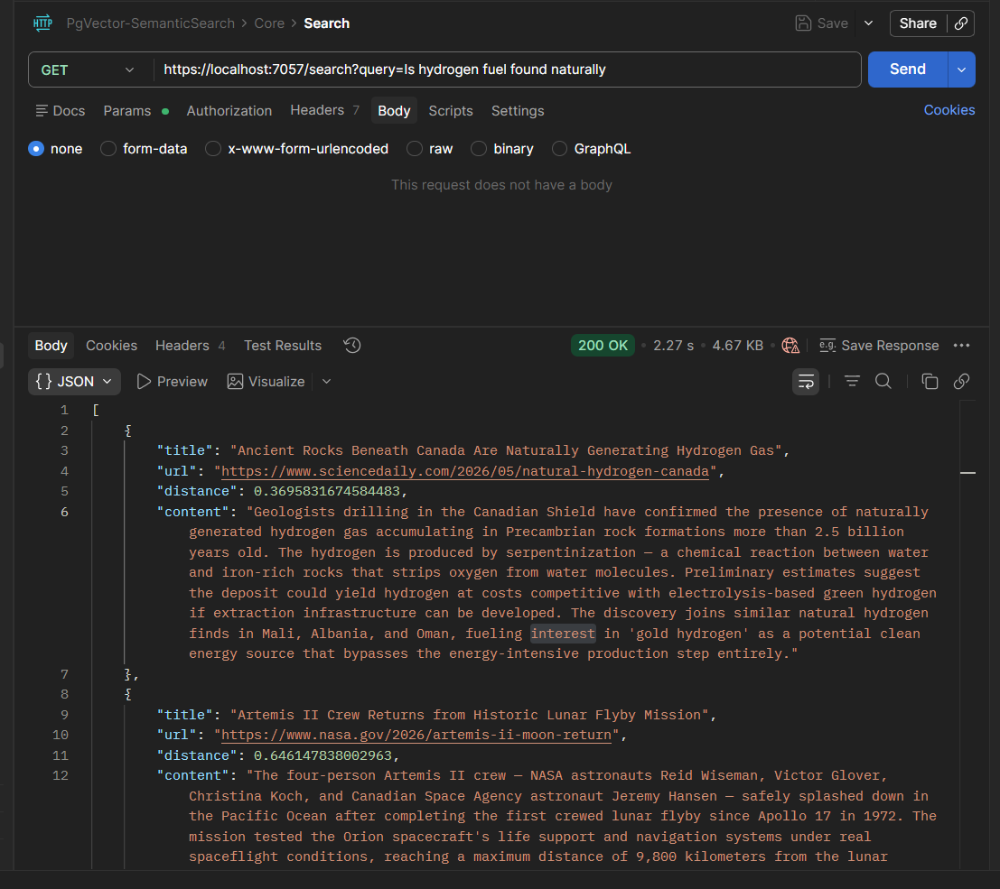

# Semantic Search with .NET Aspire, PostgreSQL & PgVector

This project demonstrates two approaches to perform semantic search using vector embeddings stored in PostgreSQL with the `pgvector` extension, orchestrated via .NET Aspire.

## Architecture

```
AppHost (Aspire Orchestrator)
├── Ollama (qwen3-embedding:0.6b)       ← embedding model
├── PostgreSQL/pgvector (port 6432)
│   ├── articles        (Dapper approach)
│   └── articles-core   (EF Core approach)
├── SemanticSearchDapperApi             ← PgVector + Dapper
└── SemanticSearchEFCore                ← PgVector + EF Core
```

## Projects

| Project | Description |
|---|---|
| `AppHost` | .NET Aspire orchestrator — wires up Postgres, Ollama, and both APIs |
| `ServiceDefaults` | Shared observability, health checks, and service discovery config |
| `SemanticSearchDapperApi` | Minimal API using Dapper for raw SQL vector queries |
| `SemanticSearchEFCore` | Minimal API using EF Core with `Pgvector.EntityFrameworkCore` |

## Approaches

### PgVector & Dapper



Uses `Npgsql` + `Dapper` + `Pgvector.Dapper` with raw SQL for full control over the vector query.

**Key endpoints:**

| Method | Endpoint | Description |
|---|---|---|
| `POST` | `/init` | Creates `vector` extension, `articles` table, and HNSW index |
| `POST` | `/articles` | Reads `articles.json`, generates embeddings, inserts into DB |
| `POST` | `/search?query=` | Returns top 5 semantically similar articles |

**Search query:**
```sql
SELECT url, title, embedding <=> @embedding AS distance
FROM articles
ORDER BY embedding <=> @embedding
LIMIT 5
```

---

### PgVector & EF Core



Uses `Npgsql.EntityFrameworkCore.PostgreSQL` + `Pgvector.EntityFrameworkCore`. EF migrations are applied automatically on startup.

**Key endpoints:**

| Method | Endpoint | Description |
|---|---|---|
| `GET` | `/ingestData` | Reads `articles.json`, generates embeddings, inserts via EF Core |
| `GET` | `/search?query=` | Returns top 5 semantically similar articles |

**Search query (LINQ → SQL):**
```csharp
dbContext.Articles
    .Select(a => new {
        a.Title, a.Url,
        Distance = a.Embedding.CosineDistance(queryEmbedding),
        a.Content
    })
    .OrderBy(a => a.Distance)
    .Take(5)
    .ToListAsync();
```

## Prerequisites

- [.NET 10 SDK](https://dotnet.microsoft.com/download)
- [Docker Desktop](https://www.docker.com/products/docker-desktop/) (for Postgres and Ollama containers)
- [.NET Aspire workload](https://learn.microsoft.com/en-us/dotnet/aspire/fundamentals/setup-tooling)

## Getting Started

```bash
# Run the Aspire AppHost — starts all containers and services
dotnet run --project Aspire.Postgres.PgVector.SemanticSearch.AppHost
```

Aspire will automatically:
- Pull and start the `pgvector/pgvector:pg17` Postgres container
- Pull and start Ollama with the `qwen3-embedding:0.6b` model
- Apply EF Core migrations for the `SemanticSearchEFCore` project on startup

## EF Core Migrations

```bash
# Add a new migration
dotnet ef migrations add InitialCreate --project SemanticSearchEFCore

# Migrations are applied automatically on app startup via MigrateAsync()
```

> The connection string in `SemanticSearchEFCore/appsettings.json` is used by EF tools at design time. At runtime, Aspire injects the real connection string via service discovery.

## Tech Stack

- **.NET 10** / ASP.NET Core Minimal APIs
- **.NET Aspire 13** — orchestration, service discovery, observability
- **PostgreSQL 17** with **pgvector** extension
- **Ollama** — local LLM inference (`qwen3-embedding:0.6b`)
- **Microsoft.Extensions.AI** — embedding generation abstraction
- **Dapper** + **Pgvector.Dapper**
- **EF Core 9** + **Pgvector.EntityFrameworkCore**
