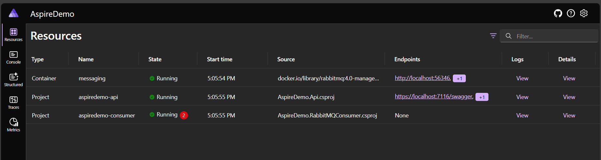
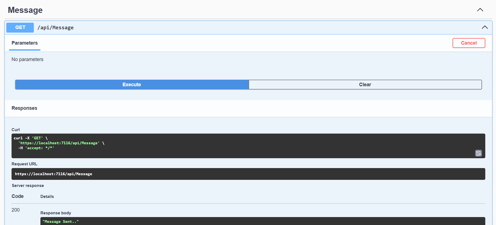
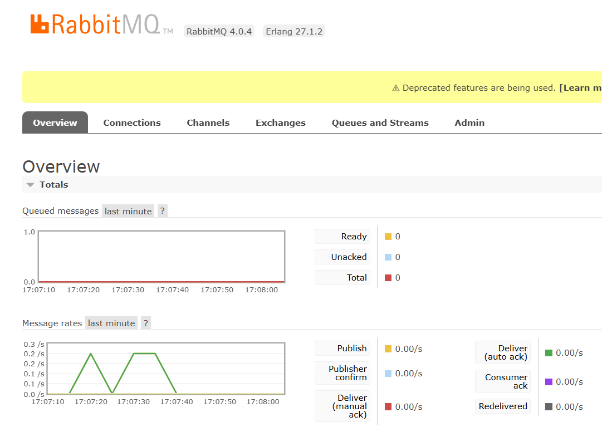
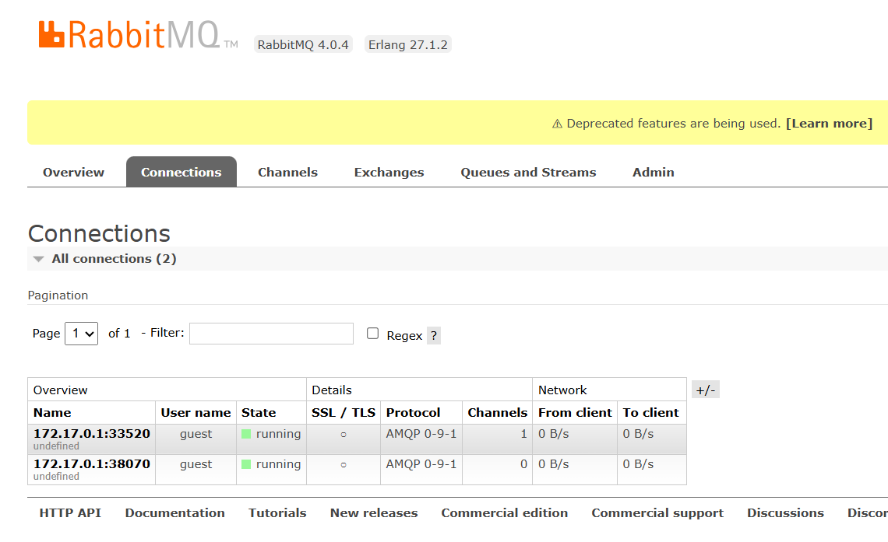
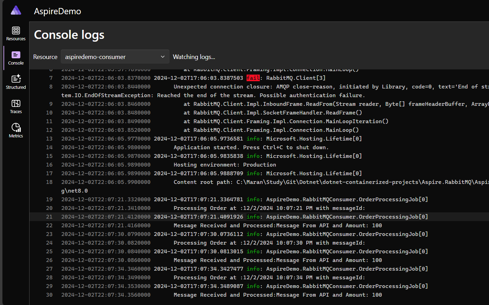

Using Aspire and RabbitMQ in .Net Web API
1. Web Api Project to publish the message
2. Aspire project to run the Containerize RabbitMQ
3. Console App to Consume the message from the RabbitMQ queue

**Aspire Dashboard**

**API to send Message**

**RabbitMQ View**

**Console App Consumer**
