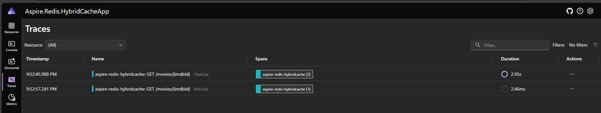
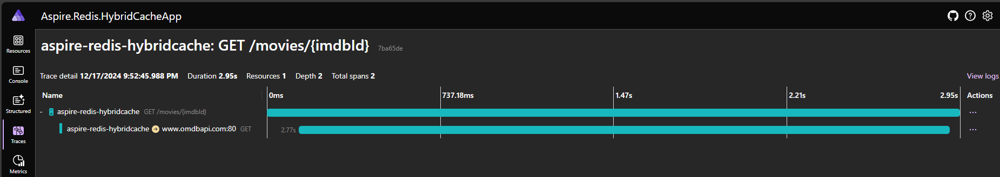
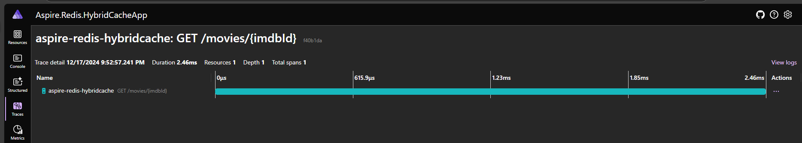
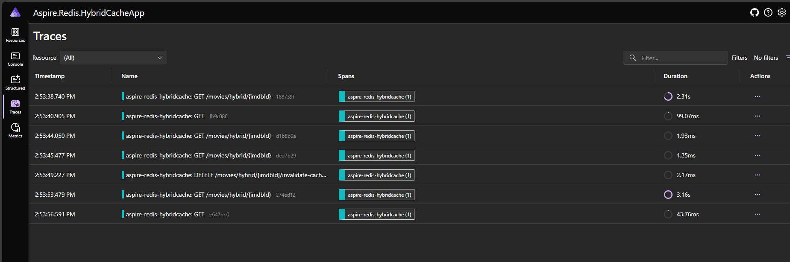
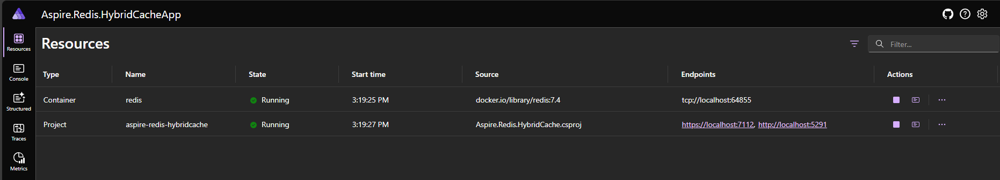
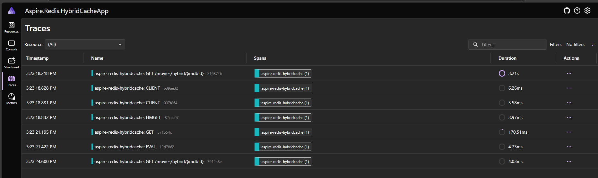
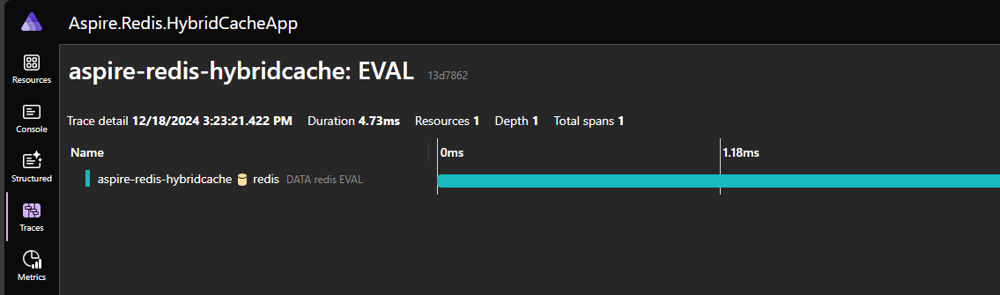
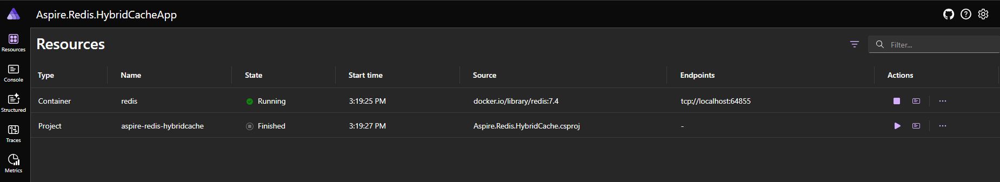
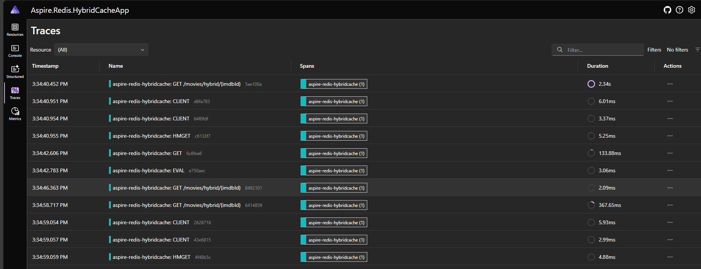
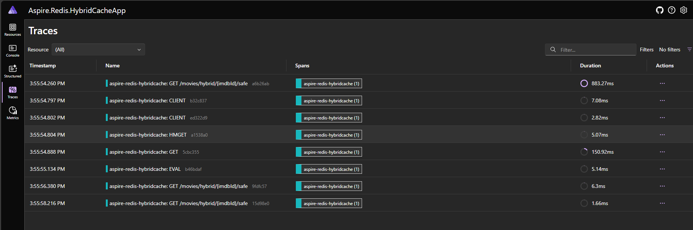

## HybridCache with Redis in Aspire .Net

1. First call hits the httpendpoints and get the results
2. When calling second time, it will bring it from the IMemoryCache

Here are the distributed Traces for the calls.

- IMemory cache is limited to single server.

With Invalidate Cache Options

Introduce Redis using .Net Aspire and Add DistributedCache in our app

Now Stop our API service and continue to run the Redis. This action will remove the cache information from the local cache. As Redis is running, the data will persist there.

Now Start and test the endpoint. 

## Concurrent call to Hybrid cache.

- Call concurrently to the Hybrid cache API.
- It will cache in first request and subsequent call go to the cache.

