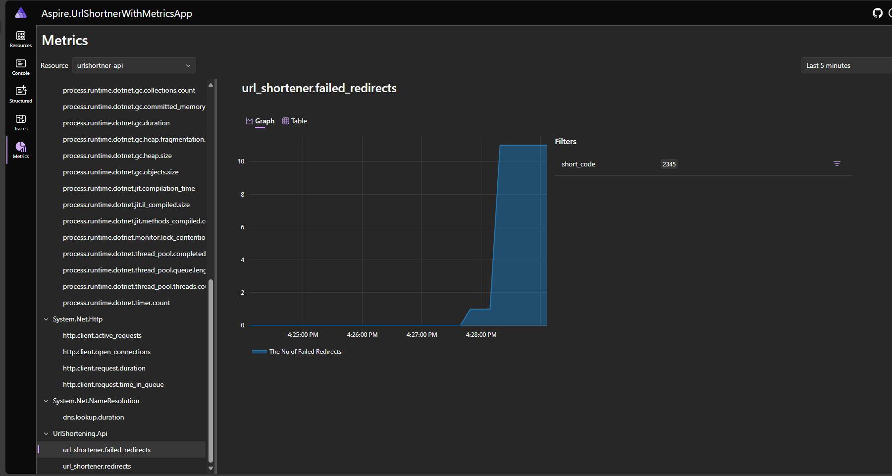

## Create URL shortener with .Net Aspire Resources (Postgres, Redis) and visualize Metrics

- Create the .Net API project with URL shortener service
- Create minimal API endpoints using CarterModule for register the endpoints.
- Add Container Orchestration support using .Net Aspire
- Add Hosting Aspire Nuget packages for Postgres and Redis
- Refer the resource in .Net web Api project
- Add HybridCache
- Add Metrics to visualize in .Net Aspire Dashboard

**.Net Aspire Dashboard**:

- Database Initialize and create tables in Postgres using BackgroundService

**Getting from the Cache**

**Metrics**

