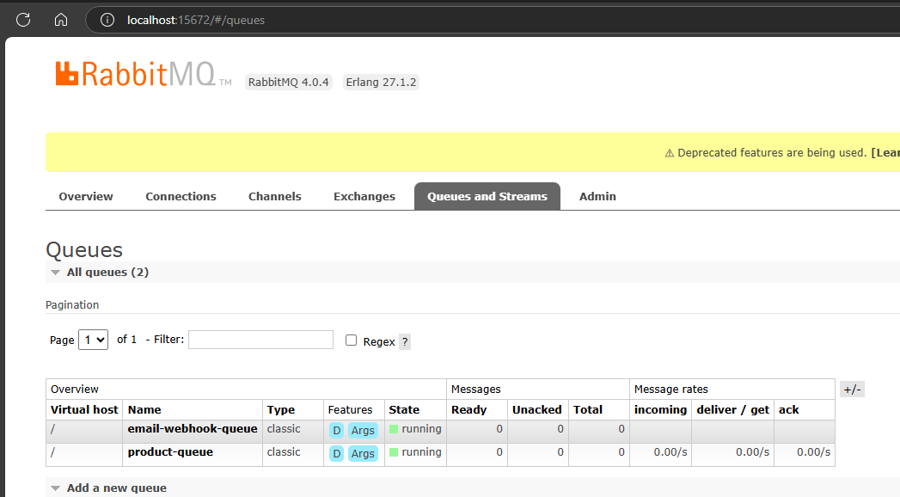

## Microservices Application with RabbitMQ messaging and Webhook

1. Products.Api : 
        - Publish a queue message when a new product is created.
2. Orders.Api : 
       - Consume the new Product and create a copy of product in Orders DB.
       - When new Order is placed, it will publish a new Order created message
3. EmailNotificationWebhook: 
       - Consumes the new order created message and congifure a webhook.
       - Webhook will trigger the new email message.

- Create Product

- RabbitMQ Queues

- New Product consumed in Order Service:

**Products db**

**Orders db's Product Table**
- Copy of the Product is received through RabbitMQ and processed in Order's service.

