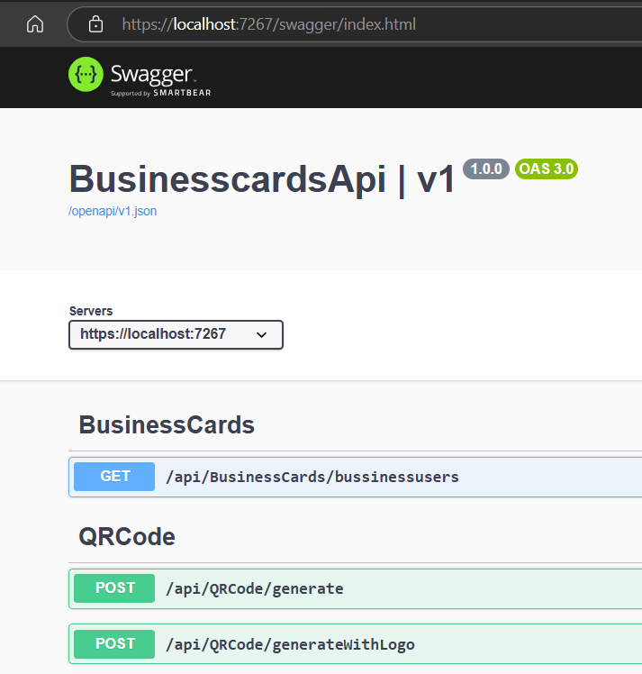
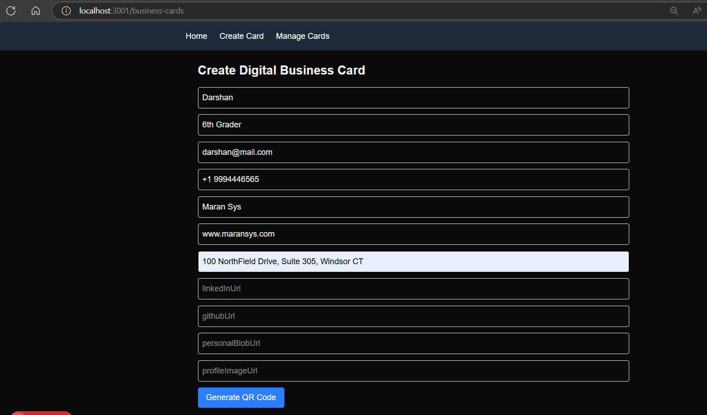
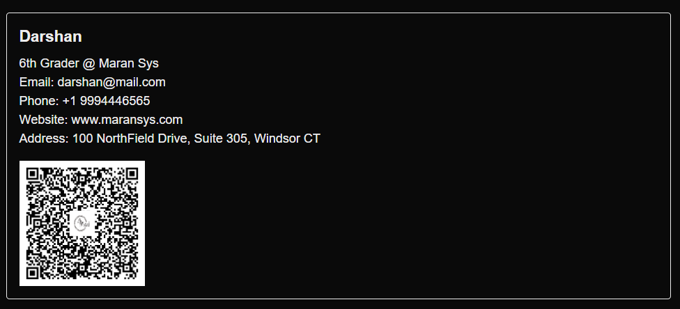

# Business Cards QR App 📇

A modern digital business card application that allows users to create, manage, and share business cards with QR codes. Built with .NET Core API backend and Next.js frontend, containerized with Docker.

## 🌟 Features

- **Create Digital Business Cards**: Store contact information including name, title, email, phone, company, and social links
- **QR Code Generation**: Generate QR codes for business cards in vCard format for easy mobile sharing
- **Logo Integration**: Create QR codes with custom logos
- **Responsive Web Interface**: Modern Next.js frontend with Tailwind CSS
- **RESTful API**: .NET Core Web API with PostgreSQL database
- **Containerized Deployment**: Docker Compose setup for easy deployment
- **Database Management**: Entity Framework Core with automatic migrations

## 🏗️ Architecture

```
BusinesscardsQRApp/
├── BusinesscardsApi/          # .NET Core Web API
│   ├── Controllers/           # API endpoints
│   ├── Models/               # Data models
│   ├── Services/             # Business logic
│   └── Data/                 # Database context
├── Businesscards/            # Next.js Frontend
│   └── businesscards-app/    # React application
└── docker-compose.yml        # Container orchestration
```

## 🛠️ Technology Stack

### Backend
- **.NET Core 9.0** - Web API framework
- **Entity Framework Core** - ORM for database operations
- **PostgreSQL** - Primary database
- **QR Code Generation** - Custom QR code service with logo support

### Frontend
- **Next.js 15** - React framework
- **TypeScript** - Type-safe JavaScript
- **Tailwind CSS** - Utility-first CSS framework
- **Axios** - HTTP client for API calls

### DevOps
- **Docker & Docker Compose** - Containerization
- **Aspire Dashboard** - Application monitoring

## 🚀 Getting Started

### Prerequisites

- [Docker Desktop](https://www.docker.com/products/docker-desktop/)
- [.NET 9.0 SDK](https://dotnet.microsoft.com/download/dotnet/9.0) (for local development)
- [Node.js 18+](https://nodejs.org/) (for local development)

### Quick Start with Docker

1. **Clone the repository**
   ```bash
   git clone <repository-url>
   cd BusinesscardsQRApp
   ```

2. **Start the application**
   ```bash
   docker-compose up -d
   ```

3. **Access the applications**
   - **Frontend**: http://localhost:3000
   - **API**: http://localhost:5000
   - **Aspire Dashboard**: http://localhost:18888
   - **PostgreSQL**: localhost:5432

### Local Development Setup

#### Backend API Setup

1. **Navigate to API directory**
   ```bash
   cd BusinesscardsApi
   ```

2. **Restore packages**
   ```bash
   dotnet restore
   ```

3. **Update database connection** (if needed)
   - Edit `appsettings.json` for database connection string

4. **Run migrations**
   ```bash
   dotnet ef database update
   ```

5. **Start the API**
   ```bash
   dotnet run
   ```

#### Frontend Setup

1. **Navigate to frontend directory**
   ```bash
   cd Businesscards/businesscards-app
   ```

2. **Install dependencies**
   ```bash
   npm install
   ```

3. **Start development server**
   ```bash
   npm run dev
   ```

## 📋 API Endpoints

### Business Cards
- `GET /api/BusinessCards/bussinessusers` - Get paginated business cards
  - Query parameters: `PageNumber`, `PageSize`

### QR Code Generation
- `POST /api/QRCode/generate` - Generate QR code for business card
- `POST /api/QRCode/generateWithLogo` - Generate QR code with logo

### Example Request Body
```json
{
  "fullName": "John Doe",
  "title": "Software Developer",
  "email": "john.doe@example.com",
  "phone": "+1234567890",
  "companyName": "Tech Corp",
  "website": "https://example.com",
  "address": "123 Tech Street, City, State",
  "profileImageUrl": "https://example.com/profile.jpg",
  "linkedInUrl": "https://linkedin.com/in/johndoe",
  "gitHubUrl": "https://github.com/johndoe",
  "personalBlogUrl": "https://johndoe.blog"
}
```

## 🗄️ Database Schema

### BusinessCard Table
| Column | Type | Description |
|--------|------|-------------|
| Id | int | Primary key |
| FullName | string | Contact's full name |
| Title | string | Job title |
| Email | string | Email address |
| Phone | string | Phone number |
| CompanyName | string | Company name |
| Website | string | Website URL |
| Address | string | Physical address |
| ProfileImageUrl | string | Profile image URL |
| LinkedInUrl | string | LinkedIn profile (optional) |
| GitHubUrl | string | GitHub profile (optional) |
| PersonalBlogUrl | string | Personal blog URL (optional) |

## 🔧 Configuration

### Environment Variables

#### API Configuration (`appsettings.json`)
```json
{
  "ConnectionStrings": {
    "default": "Host=localhost;Database=businesscards;Username=postgres;Password=postgres"
  }
}
```

#### Frontend Configuration (`appConfig.ts`)
```typescript
const appConfig = {
    version: "1.0.0",
    copyright: `© ${new Date().getFullYear()} MaranSys`,
};
```

## 🐳 Docker Services

The application uses Docker Compose with the following services:

- **aspire-dashboard**: Application monitoring dashboard (Port: 18888)
- **postgres**: PostgreSQL database (Port: 5432)
- **businesscards-api**: .NET Core API (Port: 5000)
- **businesscards-frontend**: Next.js application (Port: 3000)

## 📱 Usage

1. **Access the web application** at http://localhost:3000
2. **Create a business card** by filling in your contact information
3. **Generate QR codes** for easy sharing
4. **Manage your cards** through the web interface
5. **Share QR codes** - others can scan to automatically add your contact info

## 🤝 Contributing

1. Fork the repository
2. Create a feature branch (`git checkout -b feature/amazing-feature`)
3. Commit your changes (`git commit -m 'Add amazing feature'`)
4. Push to the branch (`git push origin feature/amazing-feature`)
5. Open a Pull Request

## 📄 License

This project is licensed under the MIT License - see the LICENSE file for details.

## 🆘 Troubleshooting

### Common Issues

1. **Database Connection Issues**
   - Ensure PostgreSQL container is running
   - Check connection string in `appsettings.json`

2. **Port Conflicts**
   - Modify ports in `docker-compose.yml` if needed
   - Ensure ports 3000, 5000, 5432, and 18888 are available

3. **Migration Issues**
   - Run `dotnet ef database update` in the API directory
   - Check database permissions

### Logs
- View container logs: `docker-compose logs [service-name]`
- API logs: Available in the Aspire Dashboard
- Frontend logs: Check browser console

## 📞 Support

For support and questions:
- Create an issue in the repository
- Check the troubleshooting section above
- Review the API documentation at http://localhost:5000/swagger

---







