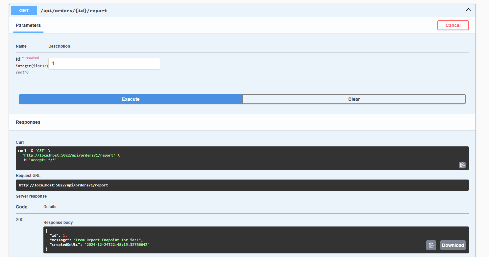
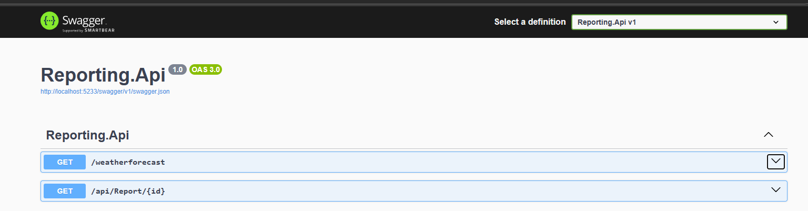
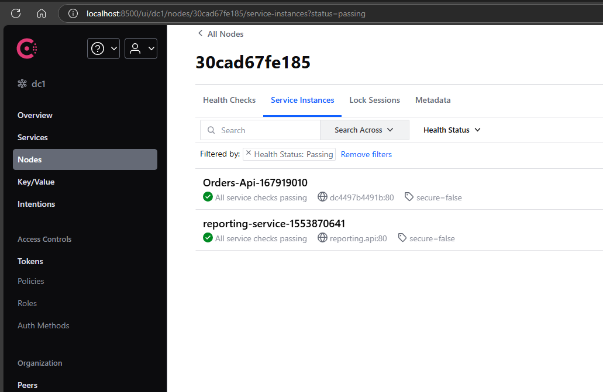
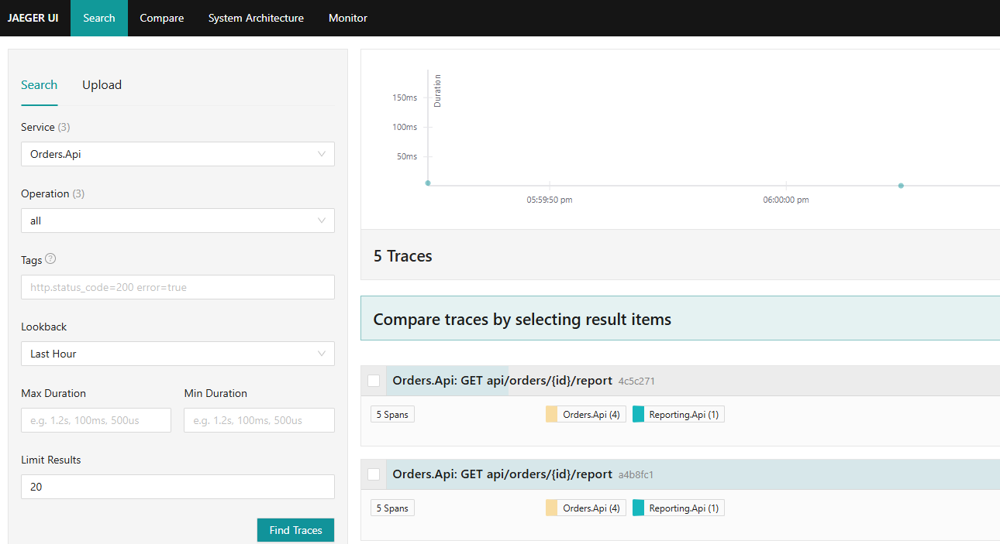
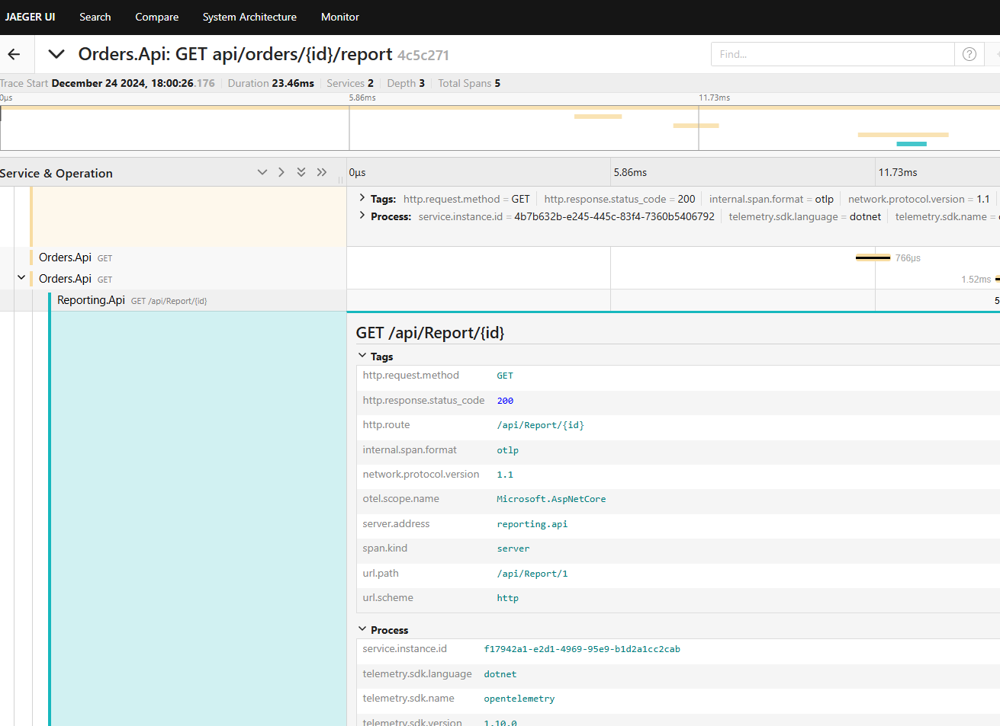

# Service Discovery using Consul
- Orders.Api
- Reporting.Api

- Orders.Api needs to call a endpoint in Reporting.Api using Http client
- Reporting.Api was registered with Consul for ServiceDiscovery.
- Use the ServiceDiscovery URL in the Orders.Api to call the Reporting.Api

- Consul Registration

- Jaeger Traces

