# Cursor Pagination with PostgreSQL and Tuple Query

This project demonstrates different pagination strategies implemented with PostgreSQL and .NET Web API, comparing their performance and optimization techniques.

## Pagination Strategies Implemented

### 1. Offset-Based Pagination
Traditional offset-based pagination implementation that uses LIMIT and OFFSET. While simple to implement, it has performance implications with large datasets.

#### Limitations:
- Performance degrades as the offset increases
- Potential for skipped or duplicate items when data changes between requests
- Full table scan required for large offsets

### 2. Cursor-Based Pagination
Implementation of cursor-based pagination using timestamps and unique identifiers to maintain consistent results and better performance.

#### Initial Implementation with Index
- Created composite index on CreatedDate and Id columns
- Query Plan Analysis showed increased execution time
- Estimated Time: 1059.604ms

```sql
CREATE INDEX idx_created_date_id ON "Products" ("CreatedDate" DESC, "Id" DESC);
```

### Offset Query
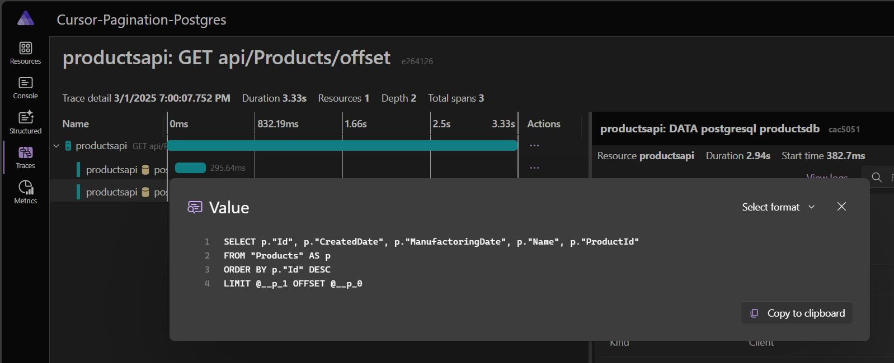

### cursor query
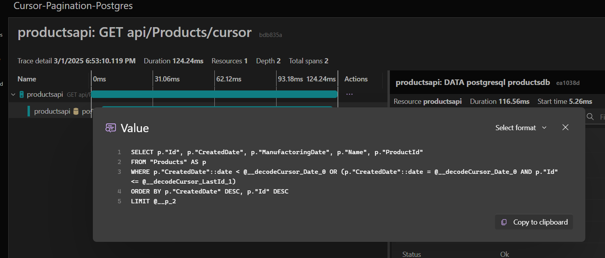

## Query Plans

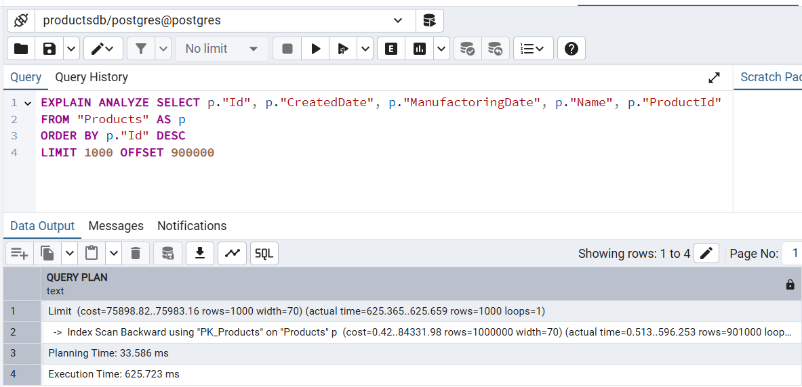

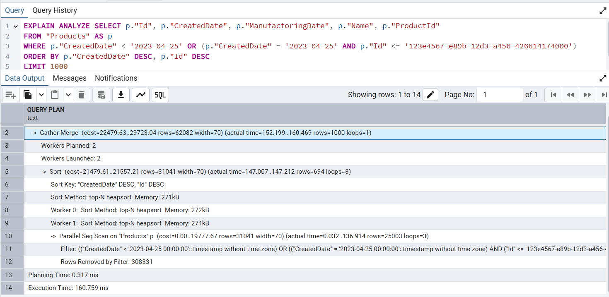


- Create Index

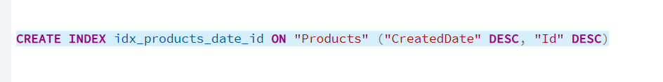

- Query Plan

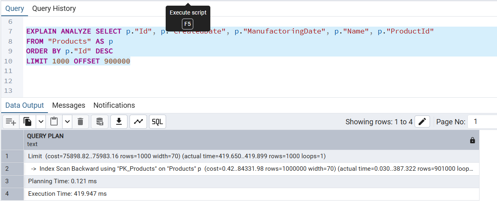

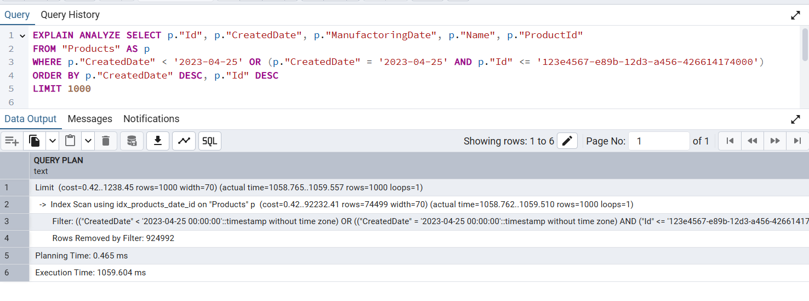

- Estimated Time:1059.604ms

- Tuple Syntax in Postgresql

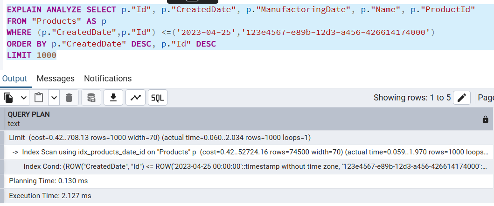

- In the above query, we don't have the Rows Removed Filter step.
- Estimated Time: 2.127 ms

After Tuple Query update:

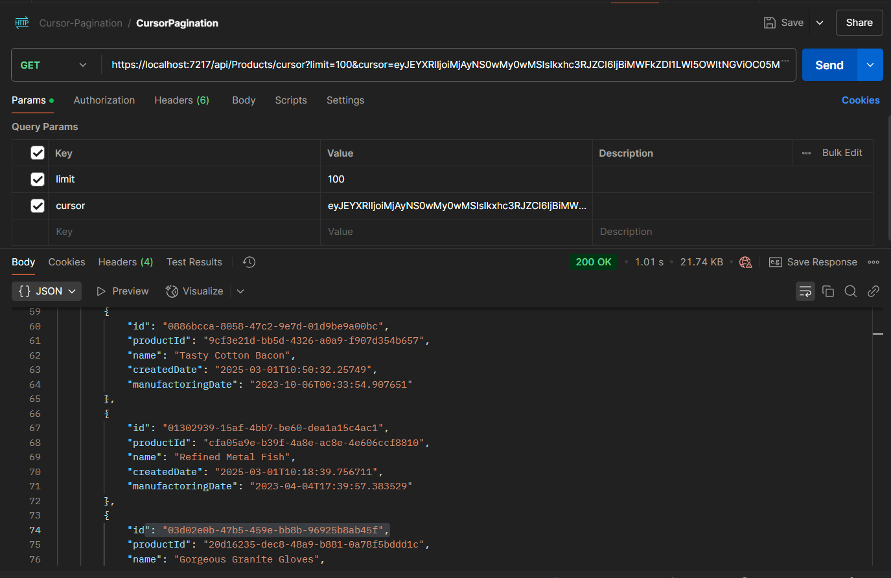

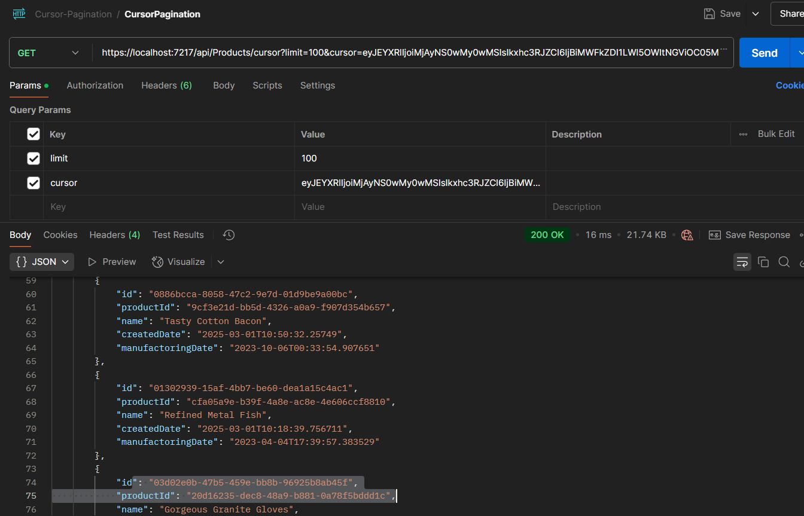

- Trace

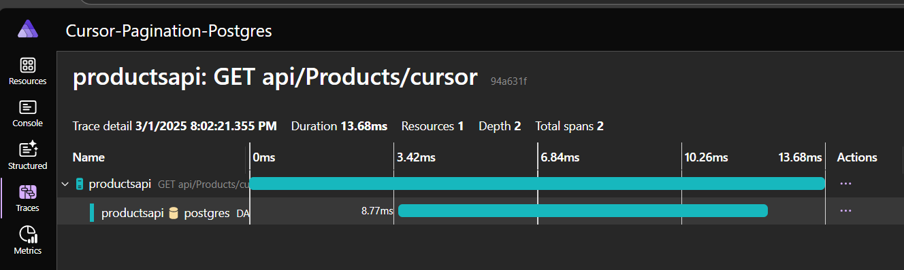

- Tuple Query

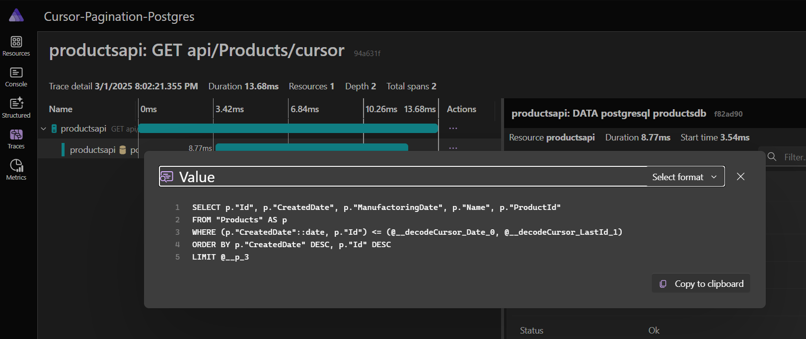

3. Optimized Cursor Pagination using Tuple Comparison
Final implementation using PostgreSQL's tuple comparison syntax, which significantly improved query performance.

Key Improvements:
 - Eliminated "Rows Removed by Filter" step from query plan

 - Drastically reduced execution time from 1059.604ms to 2.127ms

 - More efficient use of the composite index

 ```sql
 SELECT p."Id", p."CreatedDate", p."ManufactoringDate", p."Name", p."ProductId"
FROM "Products" AS p
WHERE (p."CreatedDate", p."Id") < (@date, @id)
ORDER BY p."CreatedDate" DESC, p."Id" DESC
LIMIT @limit
```

## Performance Comparison
### Query Plan Analysis

1. Offset Pagination

    - Requires full table scan for large offsets

    - Performance degrades with dataset size

2. Initial Cursor Pagination with Index

    - Created composite index

    - Execution time: ~1059.604ms

    - Additional filter steps in query plan

3. Optimized Tuple Query

    - Execution time: ~2.127ms

    - Eliminated unnecessary filter steps

    - Most efficient use of index

## Key Findings
1. Cursor pagination is more efficient than offset pagination for large datasets

2. Tuple comparison syntax in PostgreSQL provides significant performance benefits

3. Proper indexing strategy is crucial for optimal performance

4. Query plan analysis helps identify performance bottlenecks

## Implementation Details
1. Created composite index on sorting columns (CreatedDate, Id)

2. Utilized PostgreSQL's tuple comparison feature

3. Implemented stateless cursor pagination using encoded cursor values

4. Maintained consistent ordering with unique identifiers

## Best Practices
1. Always use composite indexes for cursor pagination

2. Leverage tuple comparison for better query performance

3. Include a unique identifier in the cursor to handle identical timestamps

4. Monitor query plans to ensure optimal index usage