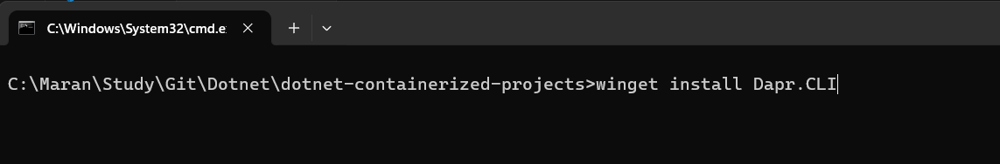
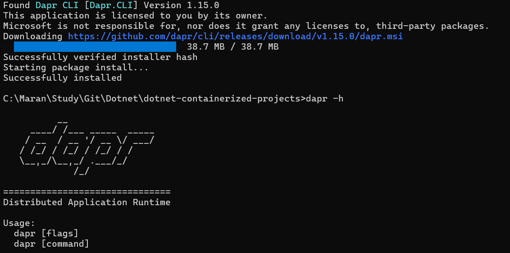
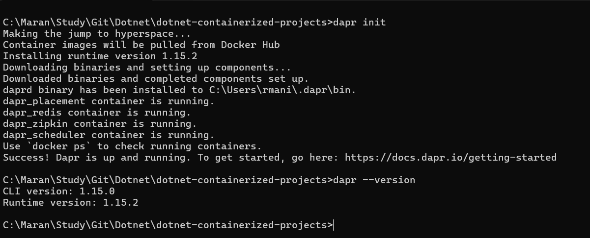
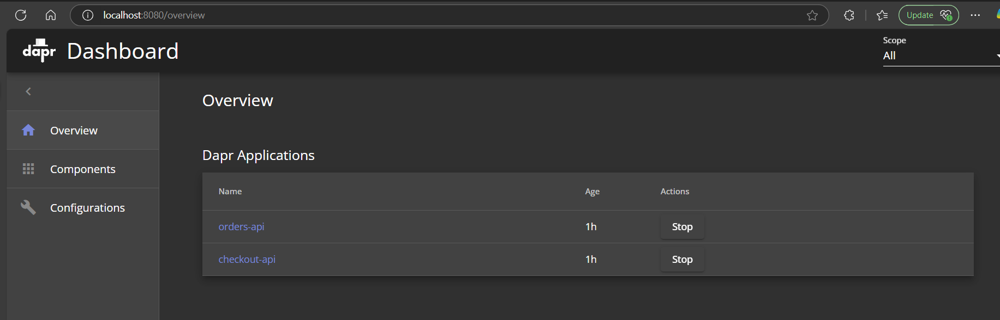

# Dapr Introduction
Dapr - Distributed Application Runtime

"Dapr is like a helpful assistant that sits next to your application and makes it easier to build microservices. Think of it as a Swiss Army knife for modern applications."

## Install Dapr CLI in Windows

```bash
 # Install using wget
 winget install Dapr.CLI
 ```





## Initialize Dapr in local environment.

```bash
# Install the latest Dapr runtime binaries
dapr init

# Verify the Dapr version
dapr --version
```




### To Start the dapr dashboard
```
> dapr dashboard

# This will launch the dashboard in http://localhost:8080
```




