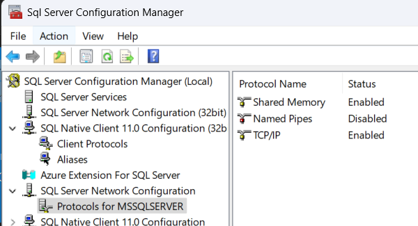
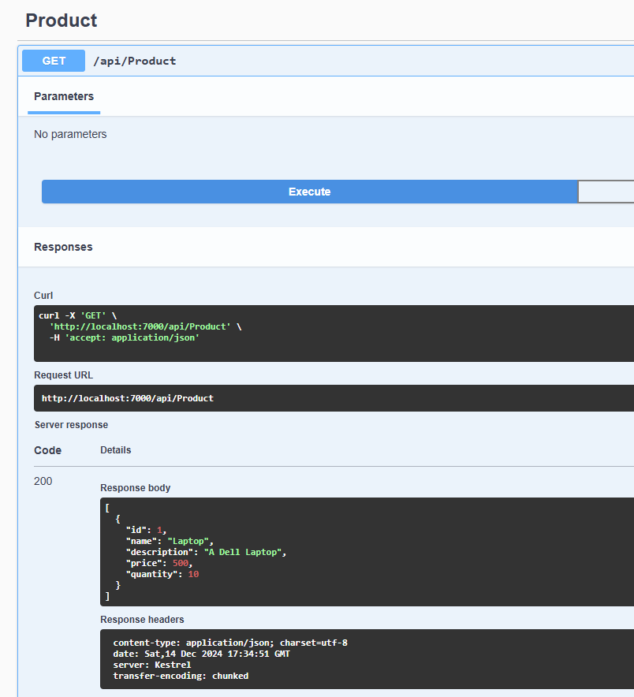

# Run .Net Web API in Docker and SQL DB in local.
### Steps Performed:

- Created a .Net web api project.
- Use Scafolding options to create a API endpoints
- Modify the connectionstring information in the appSettings.json
- Create Migrations 
- Update the database to create the db and table.
- Test the endpoints locally.
- Create the Docker file.
- Create the docker-compose file.
    - Define the connectionString in the environment variable. From docker to connect to local instance, define the server name as host.docker.internal,1433

**Issues Encountered**:

Issue: A network-related or instance-specific error occurred while establishing a connection to SQL Server. The server was not found or was not accessible.

**Root cause Identified and Troubleshooting steps**:
1. Checked the Sql server is running correctly in the local.

2. Tried connecting to sql server using command prompt
    > sqlcmd -S localhost -U sa -P password
    
3. Ensured the firewall is enabled
```sql
-- Run in SQL Server Management Studio
EXEC sys.sp_configure N'remote access', N'1'
GO
RECONFIGURE WITH OVERRIDE
GO
```
4. Checked TCP/IP is enabled. In my case it was not. Enabled in Sql Server configuration manager.



5. Checked SQL Server Browser is enabled and running. In my case it was not. Enabled and start the SQL Server Browser in services.msc

6. Restarted the SQL Server.

7. Tested the endpoints and it was working..

