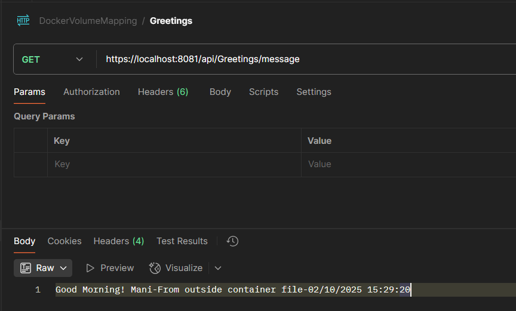

# Docker Volume Mapping in a .NET Web API

## Overview

This project demonstrates how to use Docker volume mapping in a .NET Web API application. The API allows users to upload files, which are stored in an `uploads` folder. Additionally, logging is enabled using Serilog, with logs stored in a `logs` folder. Both folders, along with `appsettings.json`, are volume-mapped in Docker using `docker-compose.yml` to ensure data persistence.

## Features

- **File Upload API**: A `POST` endpoint to upload files.
- **Configuration API**: A `GET` endpoint to retrieve messages from `appsettings.json`.
- **Serilog Logging**: Logs requests and application events to a file.
- **Docker Volume Mapping**:
  - `uploads` folder: Stores uploaded files.
  - `logs` folder: Stores log files.
  - `appsettings.json`: Configuration file stored outside the container.

## Project Structure

```
.NET Web API Project
│── Dockerfile
│── docker-compose.yml
│── Controllers
│   └── FilesController.cs
│   └── ConfigController.cs
│── appsettings.json
│── Program.cs
│── Uploads (Mapped to volume)
│── Logs (Mapped to volume)
```

## Setting Up the Project

### 1. Build and Run the API in Docker

Ensure Docker and Docker Compose are installed. Then, execute the following commands:

```sh
docker-compose up --build
```

This will build and run the application, mapping the `uploads`, `logs`, and `appsettings.json` as volumes.

### 2. API Endpoints

#### Upload File

**Endpoint:** `POST /api/files/upload`

**Usage:** Send a file in a multipart form-data request.

**Example using cURL:**

```sh
curl -X POST "http://localhost:8081/api/files/upload" \
  -F "file=@path/to/your/file.txt"
```

#### Get Configuration Message

**Endpoint:** `GET /api/config/message`

**Usage:** Retrieves the `GreetingMessage` from `appsettings.json`.

**Example using cURL:**

```sh
curl -X GET "http://localhost:8081/api/Greetings/message"
```

### 3. Docker-Compose Volume Mapping

In `docker-compose.yml`, volumes are defined to persist data even when the container restarts.

```yaml
version: '3.8'
services:
  webapi:
    build: .
    ports:
      - "8080:8080"
      - "8081:8081"
    volumes:
      - ./uploads:/app/uploads
      - ./logs:/app/logs
      - ./appsettings.json:/app/appsettings.json
```

This ensures that:
- Uploaded files are stored in `./uploads` on the host machine.
- Logs are stored in `./logs` on the host machine.
- `appsettings.json` is stored outside the container, allowing configuration changes without rebuilding the image.

### 4. Serilog Configuration

Serilog is configured in `Program.cs` to log to a file in the `logs` folder:

```csharp
Log.Logger = new LoggerConfiguration()
    .WriteTo.File("logs/app.log", rollingInterval: RollingInterval.Day)
    .CreateLogger();
```

### 5. Configuration Retrieval in Controller

A new `GreetingsController` is added to read values from `appsettings.json`.

```csharp
[ApiController]
[Route("api/config")]
public class GreetingsController : ControllerBase
{
    private readonly IConfiguration configuration;

    public ConfigController(IConfiguration configuration)
    {
        this.configuration = configuration;
    }

    [HttpGet("message")]
    public IActionResult Get()
    {
        var message = configuration["GreetingMessage"];
        message = $"{message}-{DateTime.Now}";
        return Ok(message);
    }
}
```




## Conclusion

By using Docker volume mapping, uploaded files, logs, and configuration settings persist even when the container restarts, making the application more robust and production-ready.

