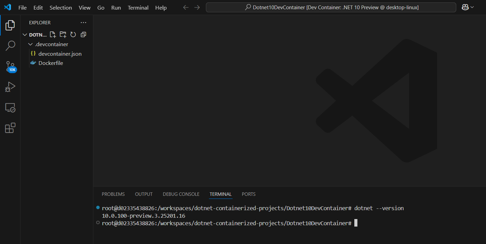
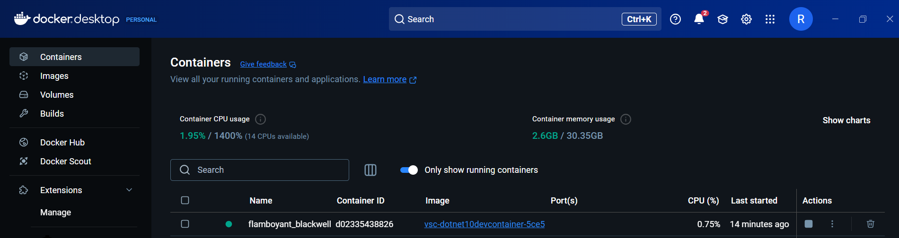
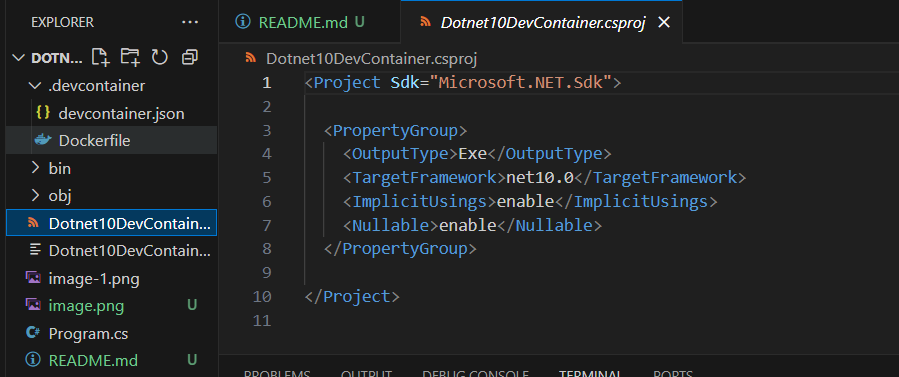

# Running .Net Preview 10 version feature using Dev Container.







```csharp
// New extension keyword to create the extension method and property 
public static class NewExtensions
{
    extension<T>(IEnumerable<T> source) where T: INumber<T>
    {
        // Extension Method
        public IEnumerable<T> WhereGreaterThan(T threshold)
            => source.Where(x=> x > threshold);

        // Extension Property
        public bool IsEmpty => !source.Any();
    }

    extension(List<int>)
    {
        public static List<int> Create() =>[];
    }
    
}
```