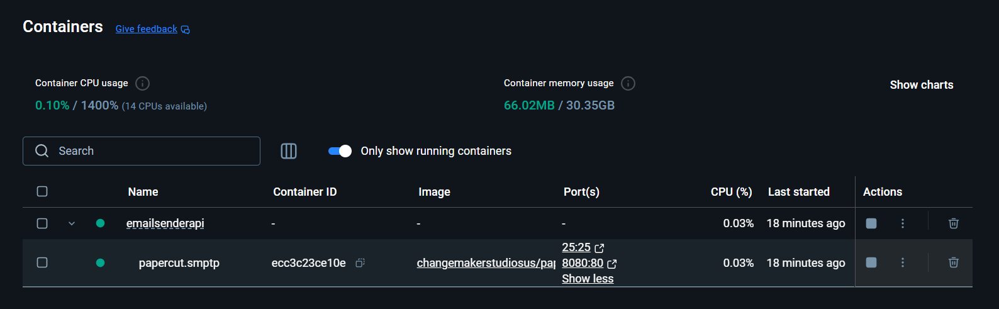
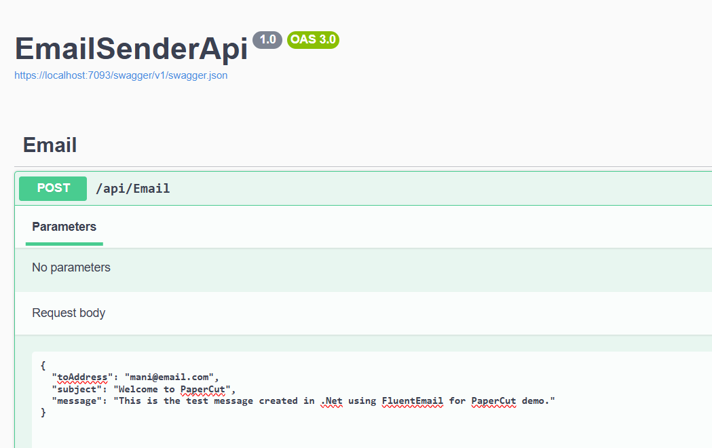
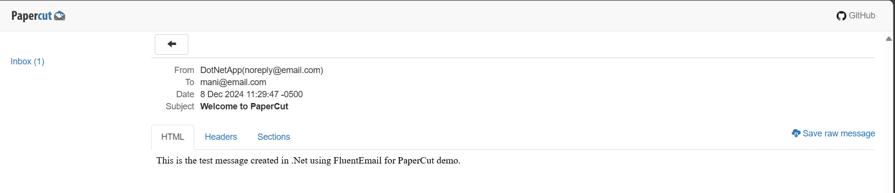

## Send Email using FluentEmail and PaperCut in .Net App

- Using docker-compose setup a service for Papercut.
- Include the Nuget package for FluentEmail.Smtp
- Setup the configuration in the appSettings and configure it in Program.cs
- Define a record for email send request
- Using FluentEmail interface send the email.
- Verify the email in the papercut.

