## Using Confluent Kafka in .Net Application to Produce and Consume messages

- Running the Kakfa in the docker. Created the docker-compose file with the Kafka services.
- Execute docker-compose up -d on the prompt window to start the containers.
- If the images are not there, it will download the images and spin up the containers.

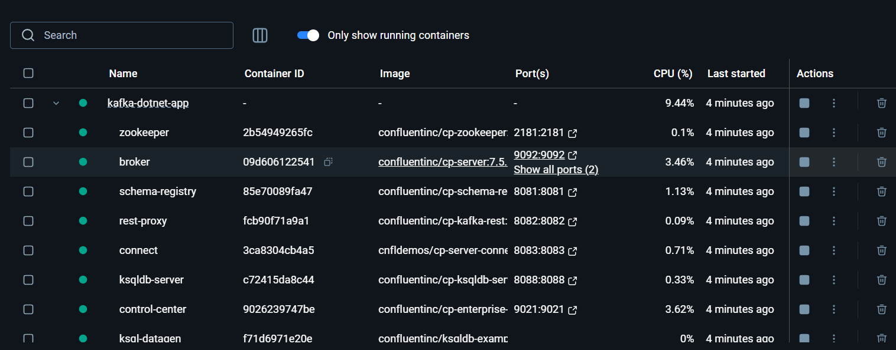

**Test the Control center**:
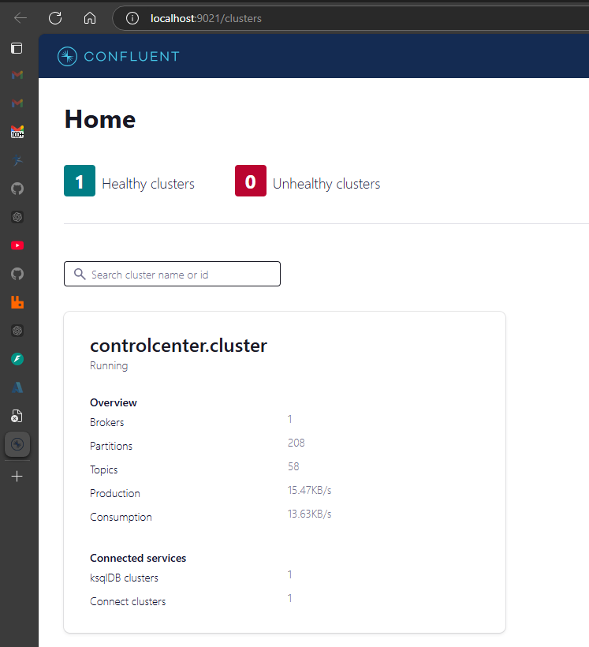

Check the Topics:Our new-order-topic is not yet created.
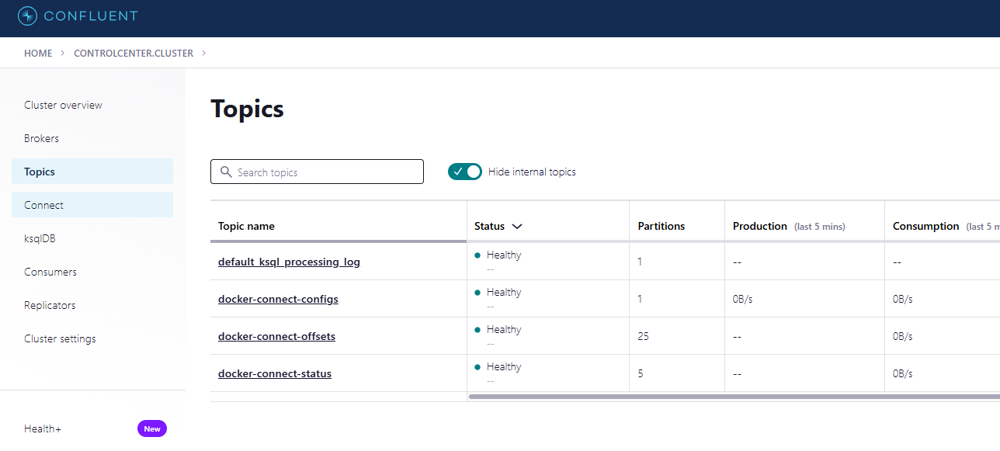

Lets run the Order's API: Create a new Order

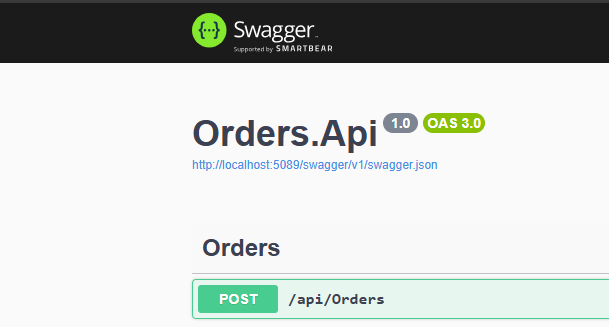

Now the Order topic will be created in Kafka as shown below.

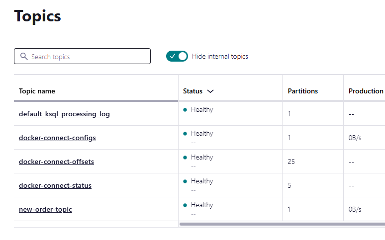

## Consumer

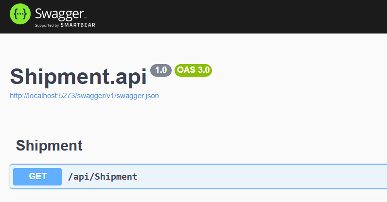

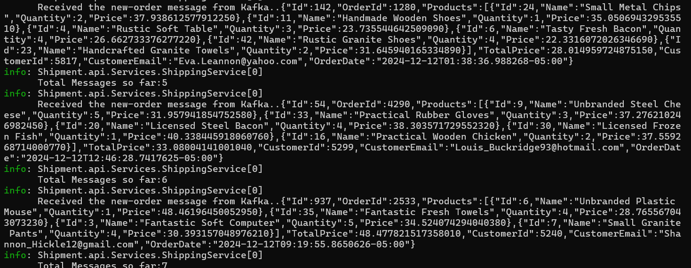

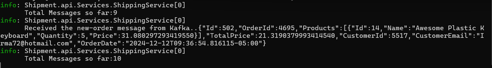

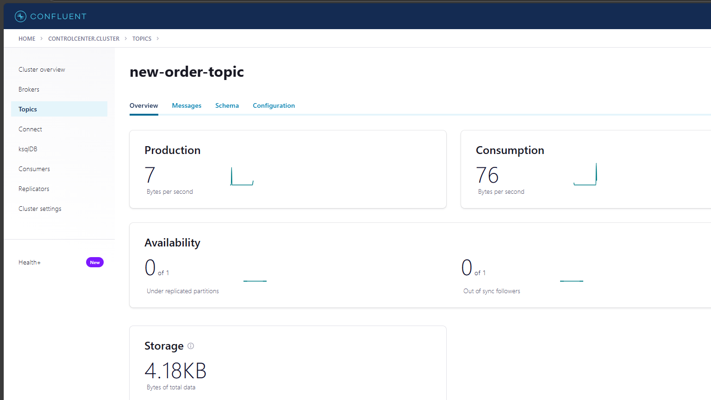

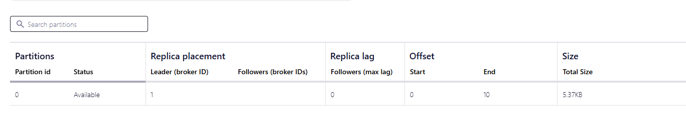

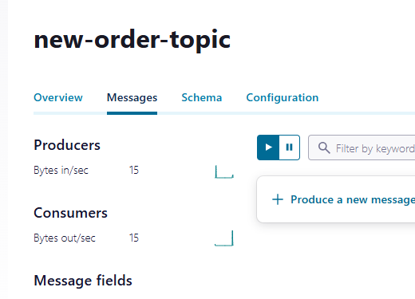

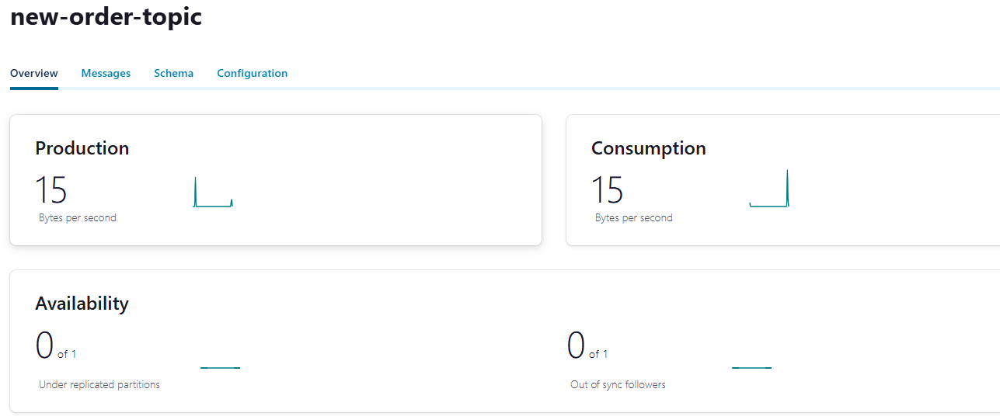