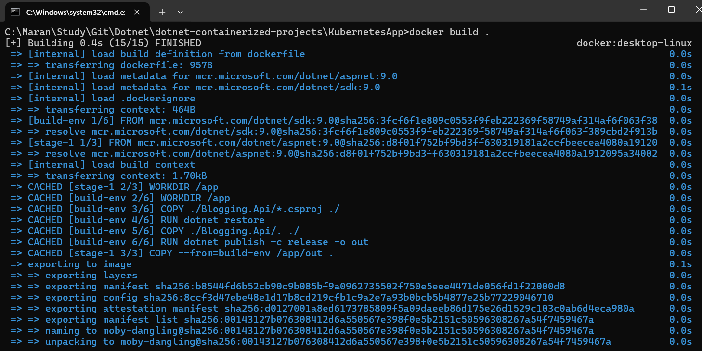
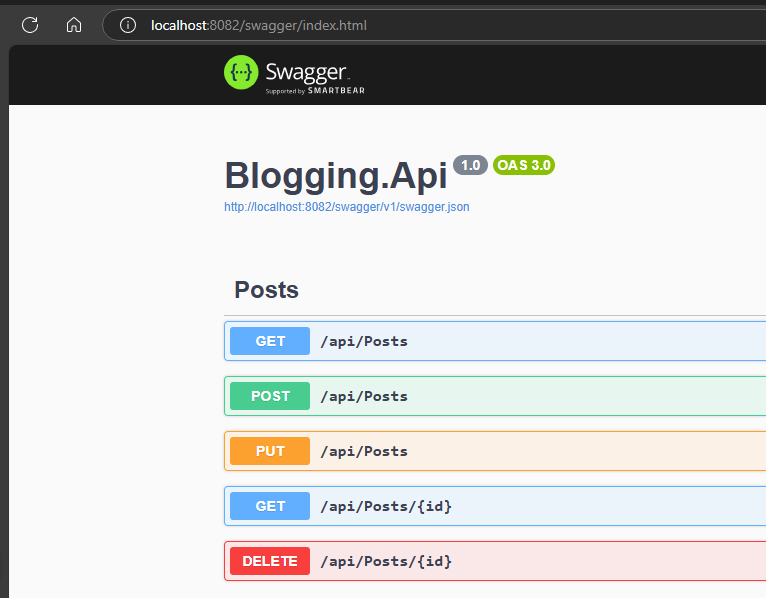
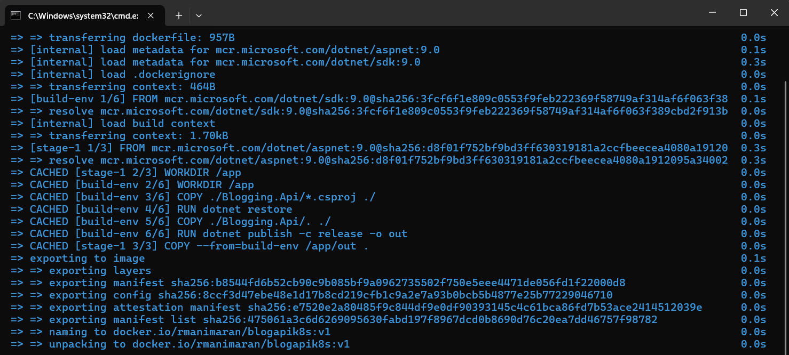
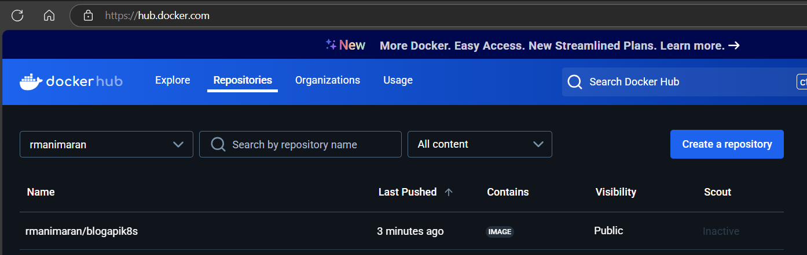
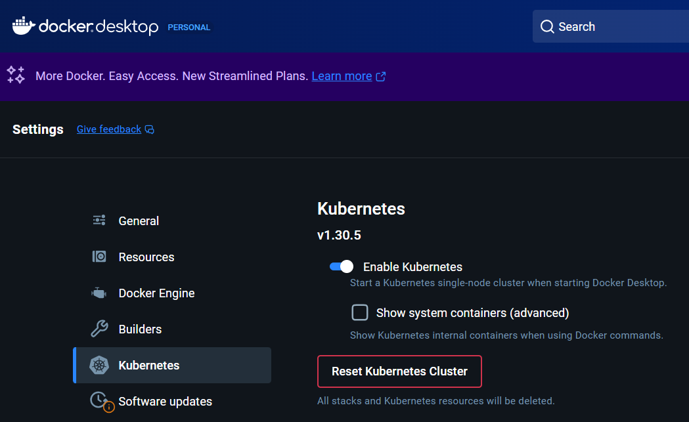
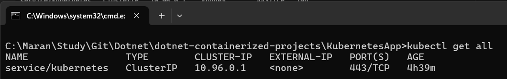
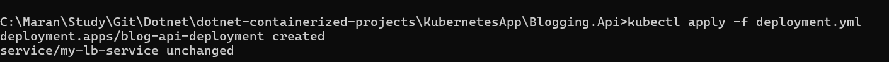
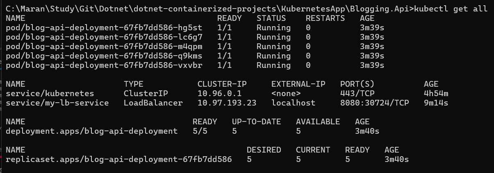
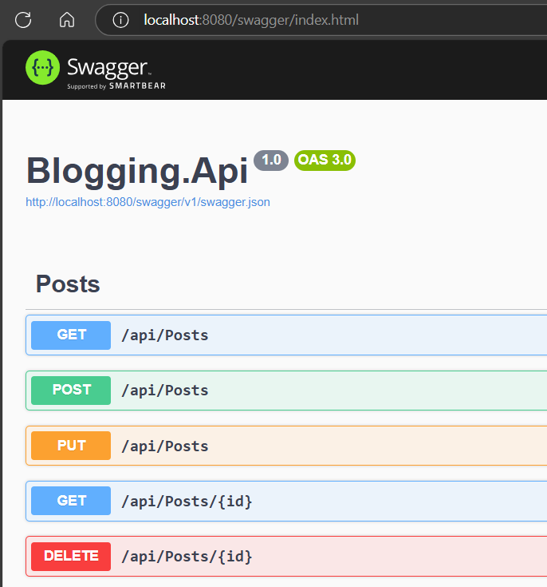
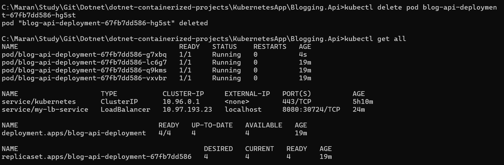

# Containerize and Orchestrate .Net API using Docker and Kubernates

1. Create a .Net Web API Project
2. Create a Docker file and mapping

```bash
 # Build the Docker file
 > docker build .
```
Successfully build and created the Image



```bash
# Build the Docker file and tag with a name
> docker build . -t blogapik8s
```

```bash
# Run the Docker image in the docker desktop
> docker run -p 8082:80 -e ASPNETCORE_URLS=http://+:80 blogapik8s
```

Now Access the Endpoints from the service running in Docker.


We are using Docker Hub as the source for Kubernetes to pick the image file. For that we need to push the docker image to docker hub.

```bash
# Create a docker image with the tag to docker hub
> docker build . -t rmanimaran/blogapik8s:v1
```


- Push the image to docker hub
```bash
# push to docker hub
 > docker push rmanimaran/blogapik8s:v1
```



## Check Kubernetes is enabled and running the docker desktop



- Run the below command to check the Kubernetes

```bash
# check k8s
> kubectl get all
```


- Apply deployment.yml

```bash
> kubectl apply -f deployment.yml 
```




- Access the api service which is running now in Kubernetes pods.





- Delete all the resources in the Yaml file
```bash
> kubectl delete -f deployment.yml
```
- To verify the deletion:
```bash
> kubectl get all

# check specific resource types
> kubectl get pods
> kubectl get deployments
> kubectl get services
```