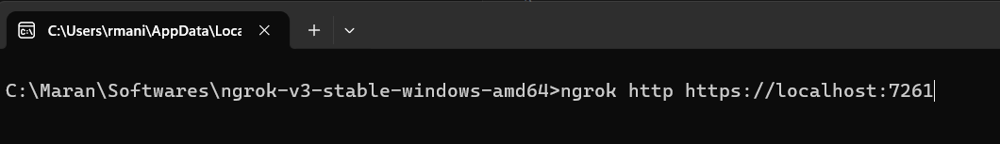
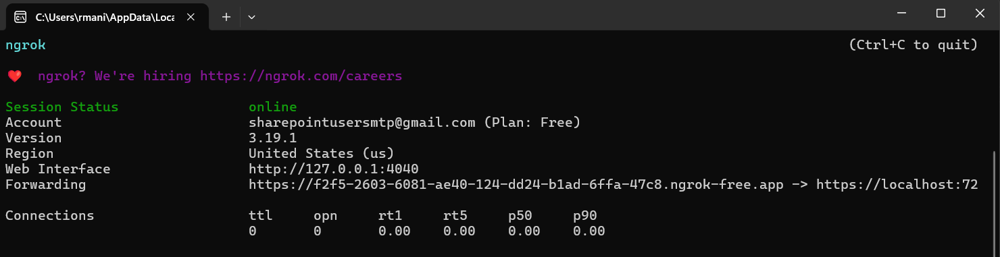
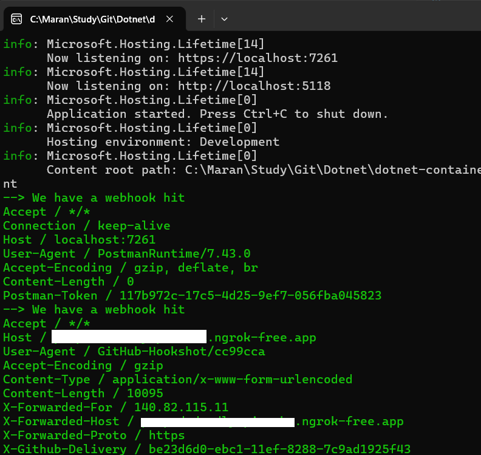

# Get the Webhooks at localhost

## using ngrok to have a Agent endpoint
- Download and install `ngrok` from the ngrok.
- Start the ngrok .exe and get the endpoint which forwards to your localhost endpoint.
- Map the endpoint in the github Repository --> Settings--> Webhooks

## Using Azure Service Bus
