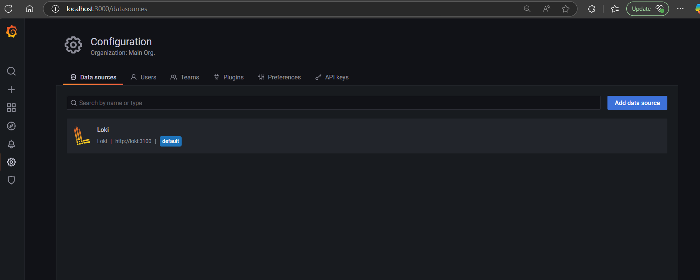
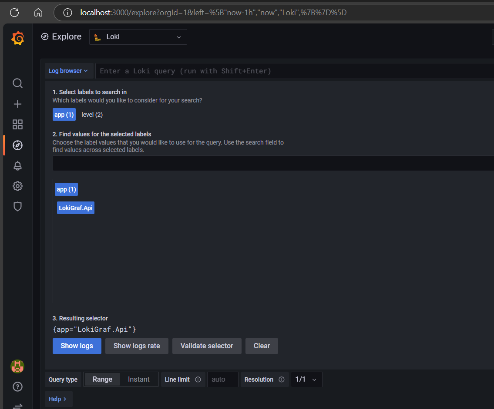
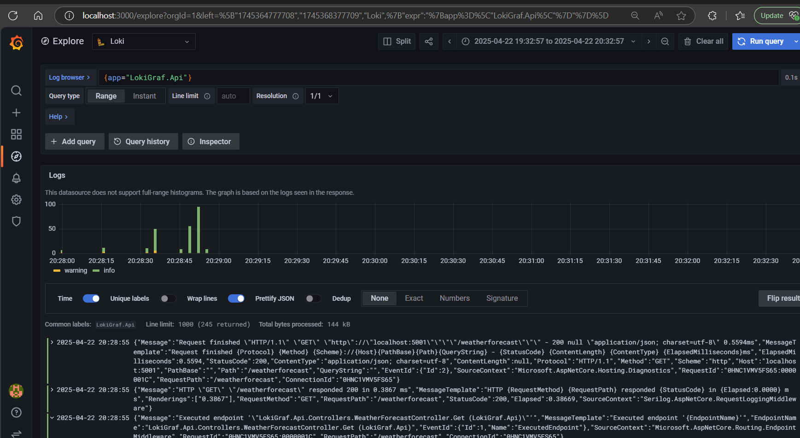
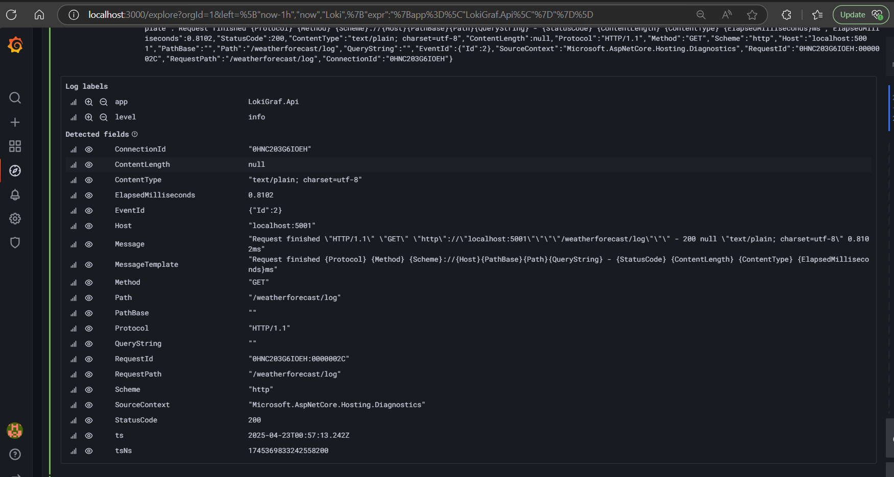

# .NET Web API Log to LOKI and Visualize in Grafana

- Run the Loki and Grafana using docker-compose file.

- In the Grafana,Add the Datasources Loki

- Enter the Url http://loki:3100 and click test and save.

- Explore and select the App in Grafana

