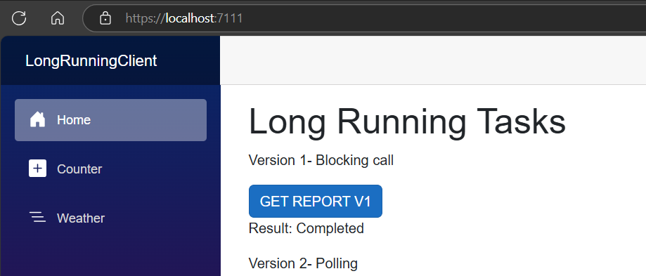
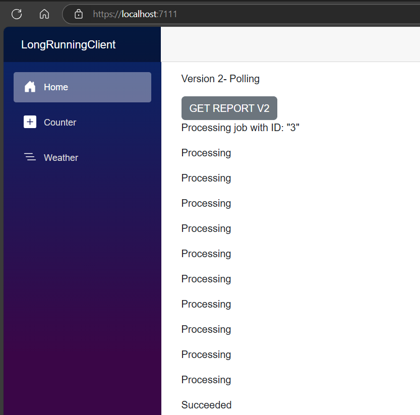
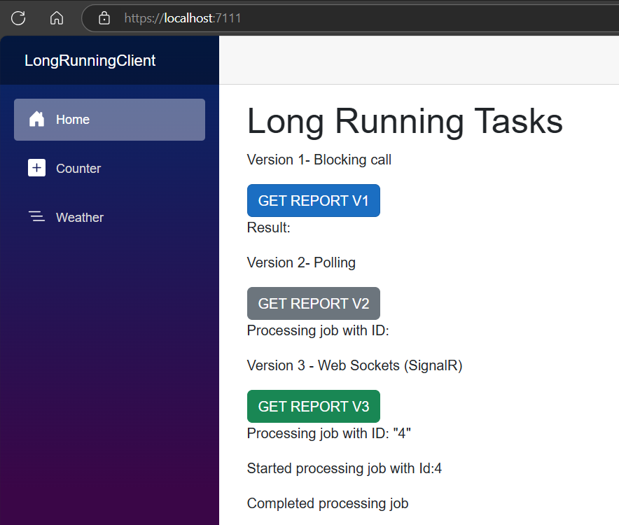
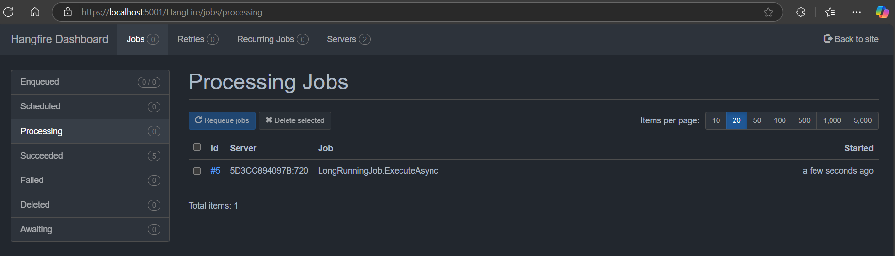
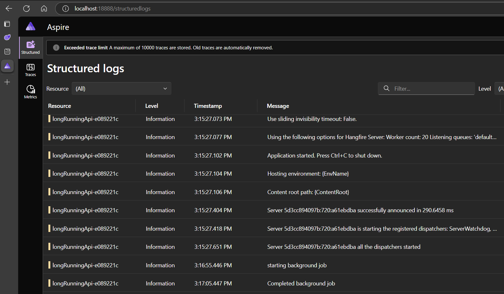

# Implementing Long running Tasks in .Net using Blazor, Hangfire & SignalR

This project demonstrates different approaches to handle long-running tasks in ASP.NET Core Web API, showcasing the evolution from simple to more sophisticated implementations.

## Approaches Implemented

### 1. Simple Synchronous Request (V1)
```csharp
app.MapGet("reports/v1", async (ILogger<Program> logger) =>
{
    // Simple delay-based implementation
    await Task.Delay(TimeSpan.FromSeconds(10));
    return "Completed";
});
```

### Limitations:

 - Blocks HTTP thread

 - Client must wait for completion

 - No progress tracking

 - Connection timeout risks

 ### 2. Background Job with Hangfire (V2)
 ```csharp
app.MapPost("reports/v2", (IBackgroundJobClient backgroundJobClient) =>
{
    string jobId = backgroundJobClient.Enqueue<LongRunningJob>(
        job => job.ExecuteAsync(CancellationToken.None));
    return Results.AcceptedAtRoute("JobDetails", new { jobId }, jobId);
});
```

### Benefits:

 - Non-blocking

 - Job persistence

 - Status tracking

 - Automatic retries

 - Dashboard for monitoring

### 3. Background Job with Real-time Updates using SignalR (V3)

```csharp
app.MapPost("reports/v3", async (
    IBackgroundJobClient backgroundJobClient, 
    IHubContext<NotificationHub> hubContext) =>
{
    string jobId = backgroundJobClient.Enqueue<LongRunningJobWithNotification>(
        job => job.ExecuteAsync(CancellationToken.None));
    await hubContext.Clients.All.SendAsync("ReceiveNotification", 
        $"Started processing job with Id:{jobId}");
    return Results.AcceptedAtRoute("JobDetails", new { jobId }, jobId);
});
```

### Benefits:

 - Real-time progress updates via SignalR

 - Non-blocking

 - Enhanced user experience

 - Job status monitoring

### Technical Stack
- ASP.NET Core : Web API framework

- Hangfire : Background job processing

- PostgreSQL : Job storage

- SignalR : Real-time communications

- OpenTelemetry : Observability and monitoring

### Key Features
  1. Job Management

        - Job queuing

        - Status tracking

        - Progress monitoring

 2. Real-time Updates

    - SignalR integration

    - Progress notifications

    - Job completion alerts

 3. Monitoring

    - OpenTelemetry integration

    - Hangfire dashboard

    - Job history tracking

### API Endpoints

- `GET` /reports/v1: Synchronous long-running task

- `POST` /reports/v2: Background job with status tracking

- `POST` /reports/v3: Background job with real-time notifications

- `GET` /jobs/{jobId}: Get job status

- `hub` /notifications: SignalR hub for real-time updates

## Configuration

### Hangfire Setup
```csharp
builder.Services.AddHangfire(config => 
    config.UsePostgreSqlStorage(connectionString));
builder.Services.AddHangfireServer();
```

### SignalR Setup
```csharp
builder.Services.AddSignalR();
app.MapHub<NotificationHub>("notifications");
```

## Best Practices Implemented
1. Asynchronous Processing
    - Non-blocking operations
    - Proper task handling

2. Error Handling
    - Job retry mechanisms
    - Exception logging

3. Scalability
   - Background job queuing
   - Database persistence

4. Monitoring
    - Telemetry integration
    - Job status tracking








### HangFire Dashboard



### Aspire Dashboard

