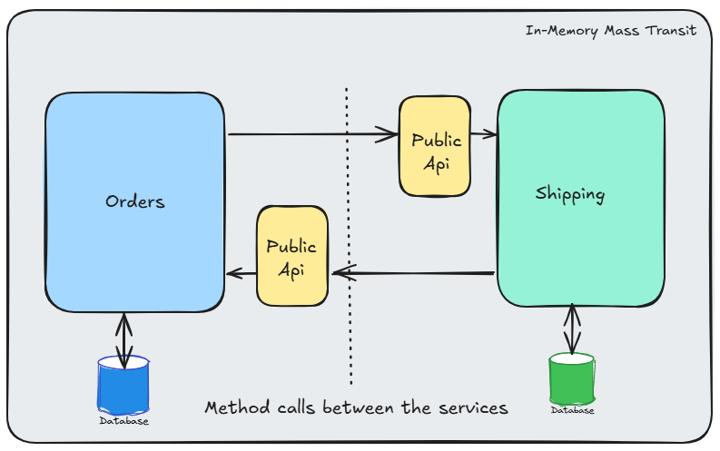
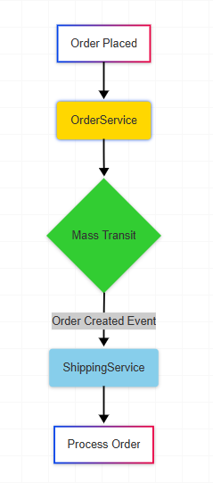
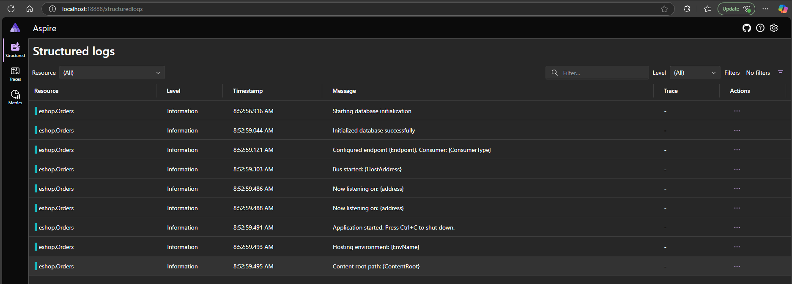
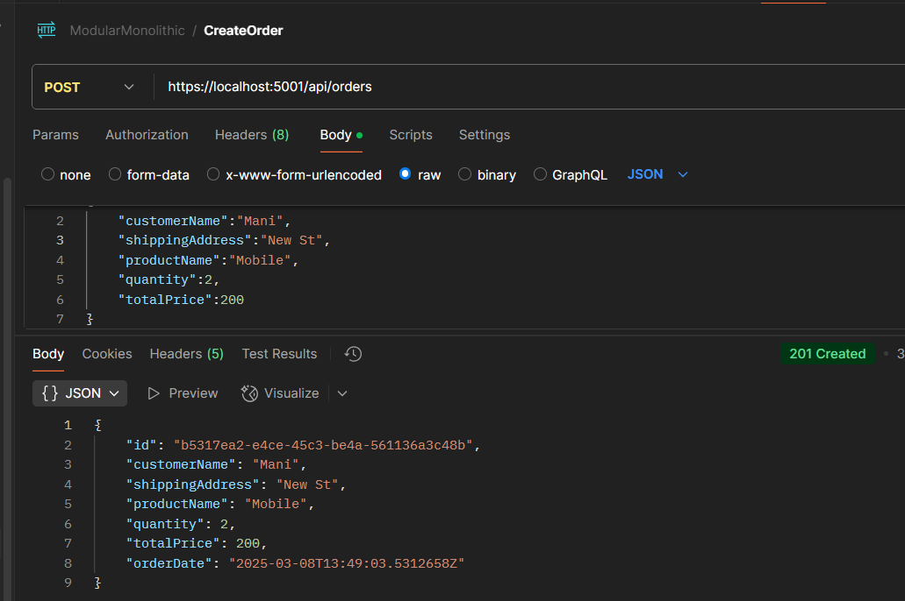
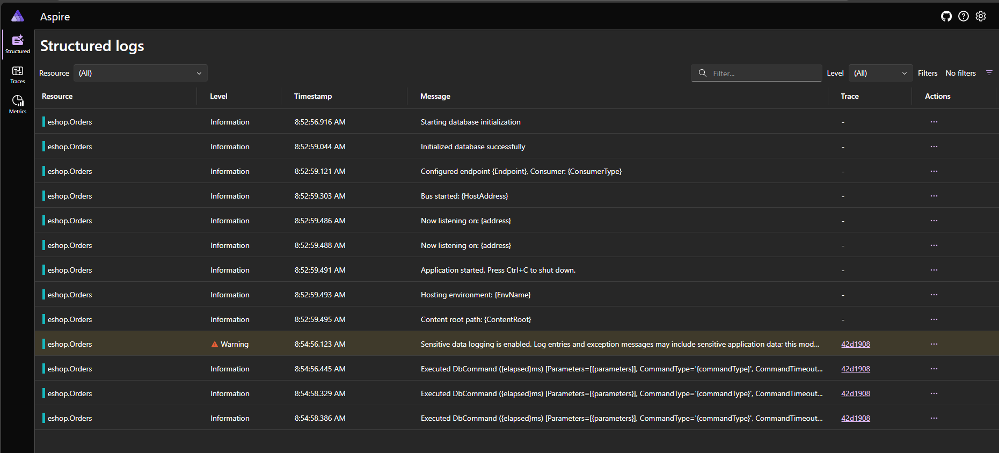
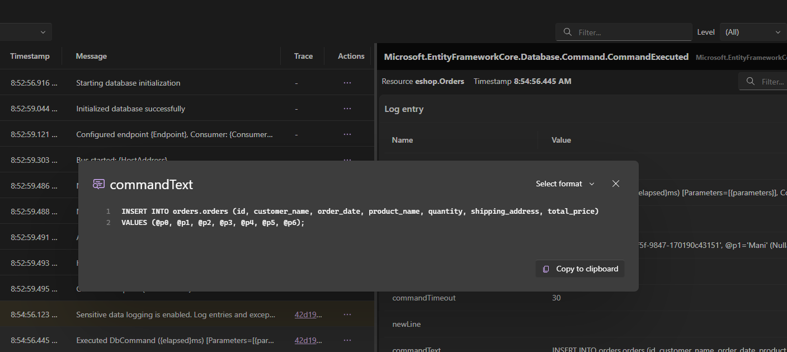
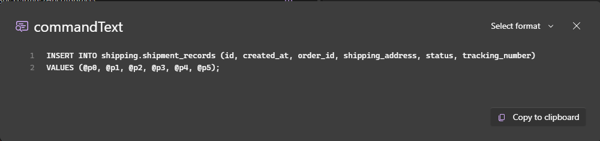
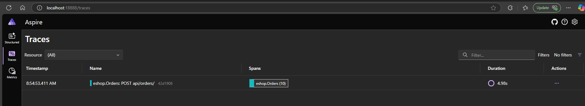
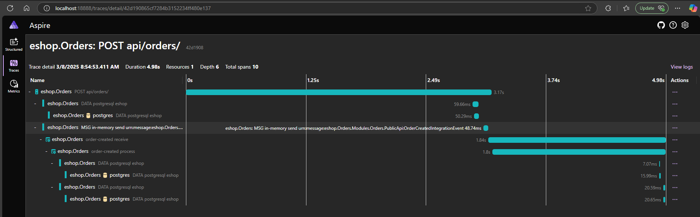
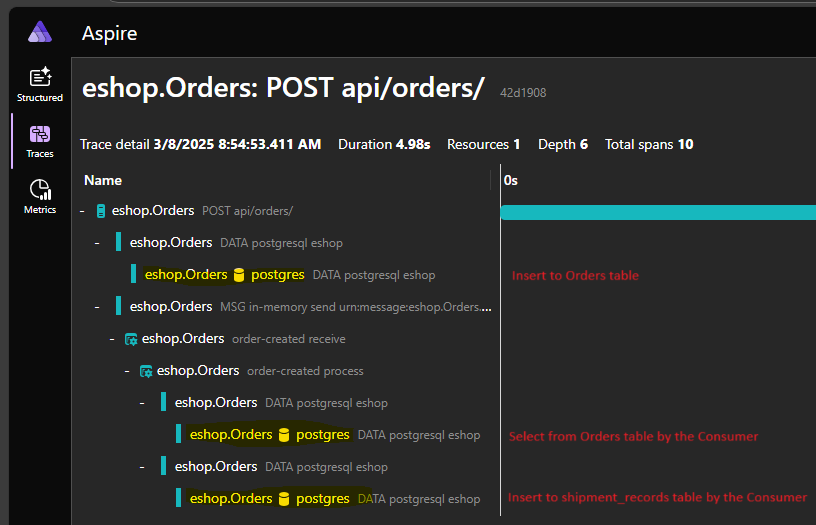

# Modular Monolith Application with In-Memory MassTransit and Aspire Dashboard

This project demonstrates a modular monolithic application architecture using .NET, showcasing communication between Orders and Shipping modules through in-memory MassTransit messaging and public APIs.

## Architecture Overview

The application is structured as a modular monolith with the following components:

- **Orders Module**: Handles order creation and management
- **Shipping Module**: Processes shipping requests for created orders
- **In-Memory MassTransit**: Manages inter-module communication
- **PostgreSQL**: Stores order and shipping data
- **Aspire Dashboard**: Provides observability and monitoring

## Tech Stack

- .NET 8+
- PostgreSQL 17
- MassTransit (In-Memory)
- OpenTelemetry
- Docker & Docker Compose
- Entity Framework Core
- Swagger/OpenAPI
- Aspire Dashboard

## Service Communication
The services communicate through:
1. Public API interfaces
2. MassTransit message contracts
3. In-memory message bus

### Message Flow

- Create a new Order

- Structured Logs

- Trace

