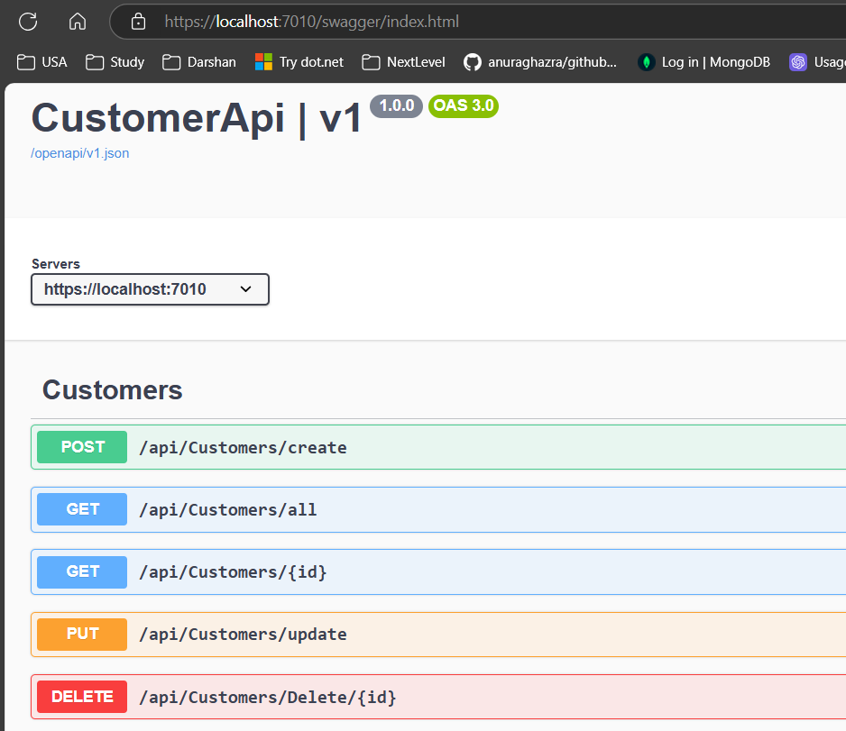
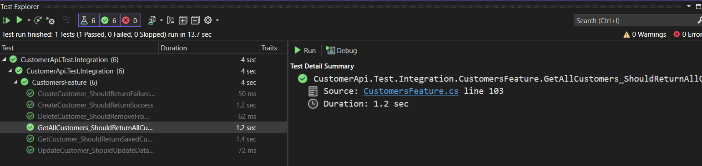
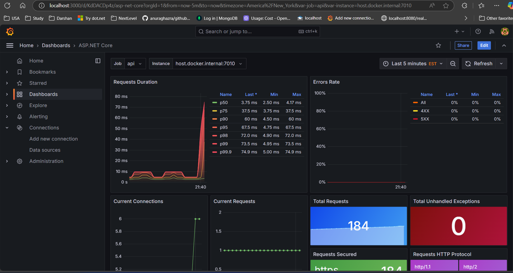
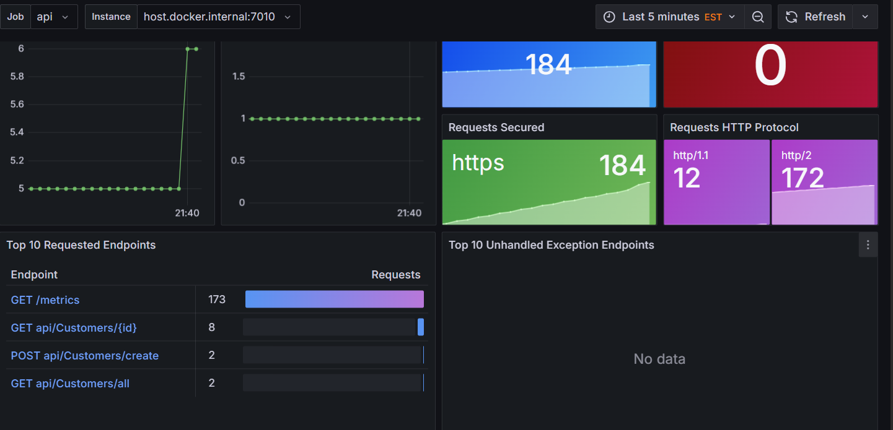
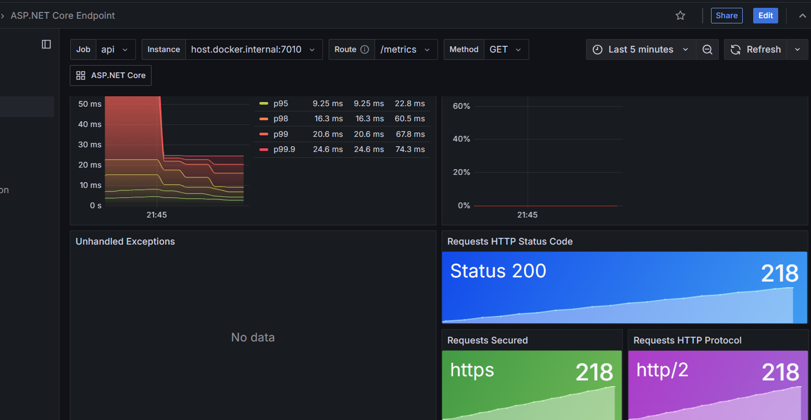

# Use TestContainer to Perform Integration Testing for the .Net Web API

## Simple API endpoints

## Simple Test for
-  Create new Customer and test the outcome. 
-  Create a user with duplicate email and test the outcome.

Here we don't have the logic to handle the duplicate email. So the second test is failing.

Prometheus:
- When Configuring Promethus.yml file use the `host.docker.internal` if the prometheus is running in the docker.
- To test the prometheus is collecting data, check the below
Using the Graph View :

Go to http://localhost:9090/graph

Click on the "Graph" tab

In the query box, you can try these queries:
# To see all available metrics
up

# For HTTP request metrics
http_requests_total

# For specific OpenTelemetry metrics
http_server_duration_seconds_count
process_runtime_dotnet_cpu_usage
process_runtime_dotnet_gc_allocations_size_bytes

Using the Table View :

Click on the "Table" tab instead of "Graph"

Enter a metric name

Click "Execute" to see the current values

Explore Available Metrics :

Click the dropdown next to the query box

This will show all available metrics that Prometheus is collecting [2]

You can also start typing to search for specific metrics

4. Check Target Status :

- Go to Status → Targets (http://localhost:9090/targets)

- Look for your API endpoint

- Check if State is "Up" (green)

- Look at "Last Scrape" to see when data was last collected

- Check "Error" column for any issues

5. Common OpenTelemetry Metrics to Query :
# HTTP request duration
histogram_quantile(0.95, sum(rate(http_server_duration_seconds_bucket[5m])) by (le))

# Request count
sum(rate(http_server_duration_seconds_count[5m])) by (http_method, http_route)

# CPU usage
process_runtime_dotnet_cpu_usage

# Memory usage
process_runtime_dotnet_gc_heap_size_bytes

## Grafana
In Grafana, when creating the datasource set the Prometheus url address to  http://prometheus:9090

## Dashboard.
- Add the Dashboards with the Dashboard Id 19924 and 19925.

