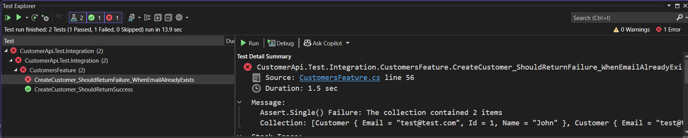

# Use TestContainer to Perform Integration Testing for the .Net Web API

## Simple Test for
-  Create new Customer and test the outcome. 
-  Create a user with duplicate email and test the outcome.

Here we don't have the logic to handle the duplicate email. So the second test is failing.

