## Implementing Outbox transaction pattern in .net web api, MassTransit, RabbitMQ

**Architecture Flow:**

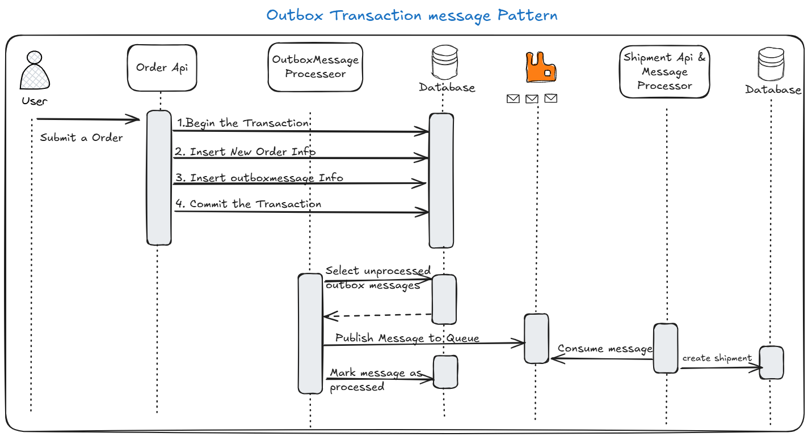

## Without Outbox pattern
 - In this approach the Orders.Api will publish a message when new order is placed and stored in SQL Server table.
 - Using MassTrasit, the message get published to RabbitMQ
 - In the Shipping.Api, we have a consumer configured which will consume the message and create a shipment entry in the SQLite database.
 - RabbitMQ is running in docker container
 - I'm running the other API's in the command prompt using dotnet run command. (Separate command prompt for both the API)

 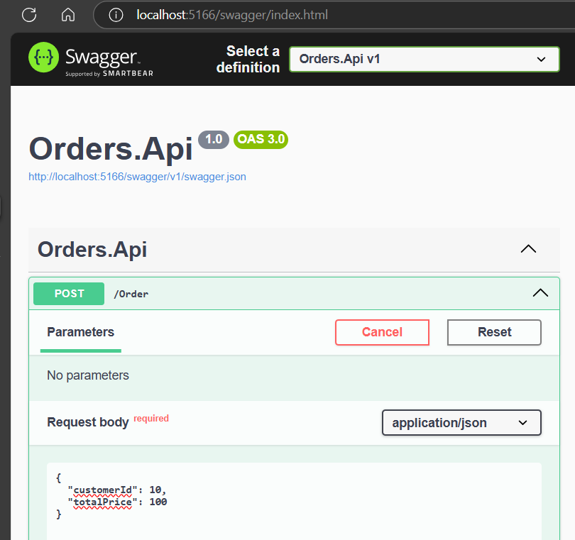

 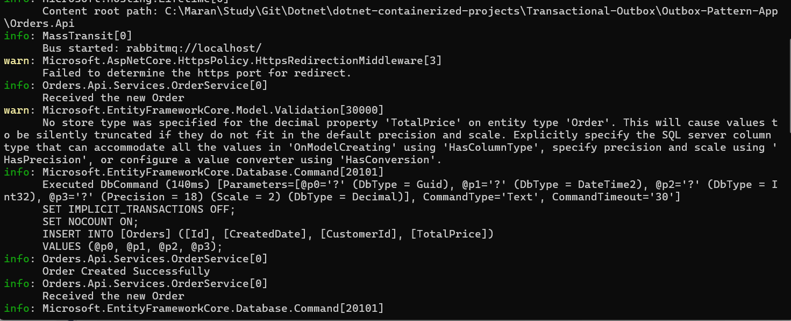

 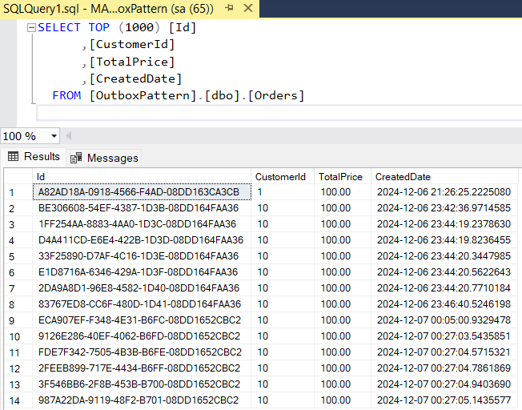

 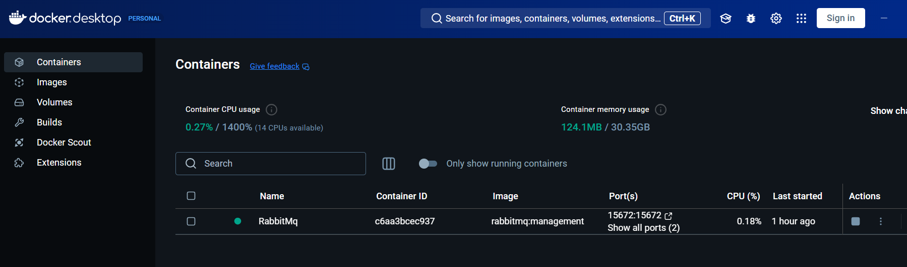

 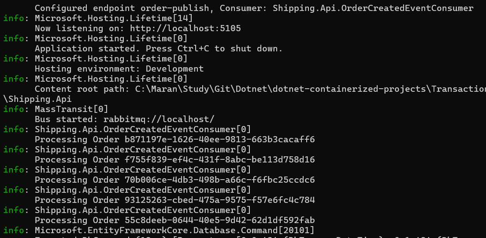

 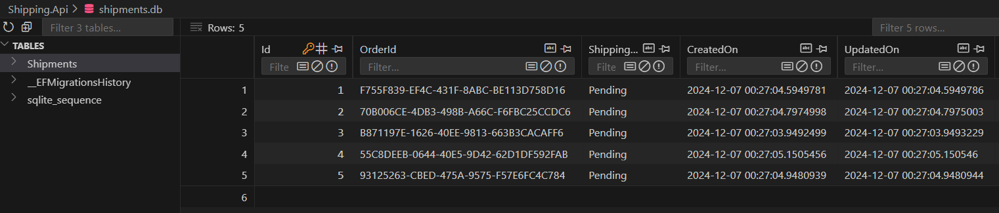

 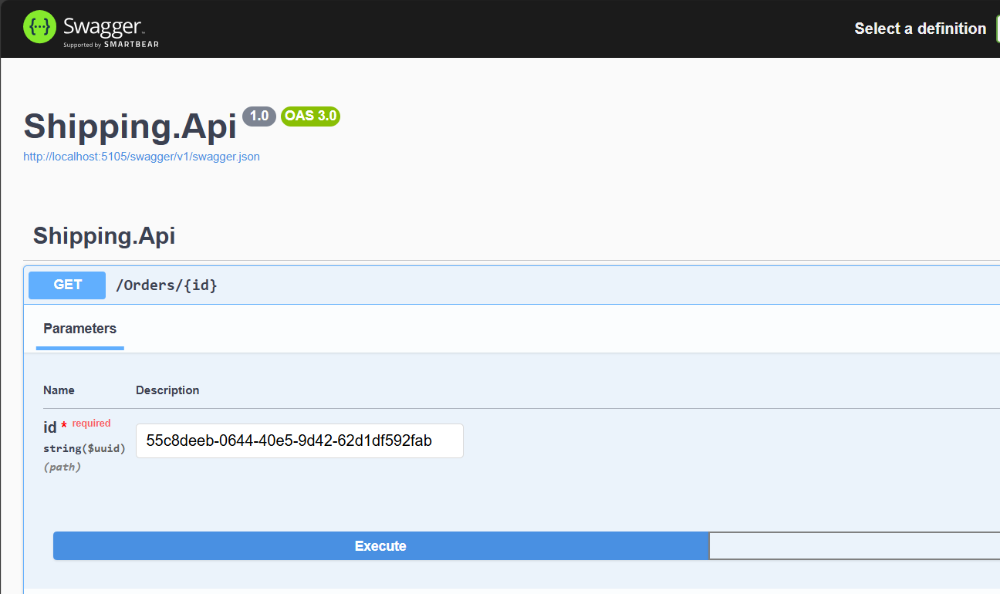

 ## Implementing Outbox message:
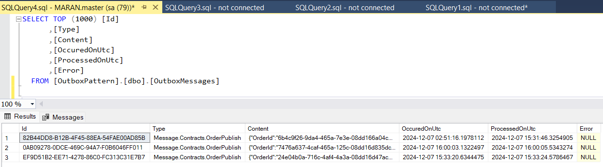

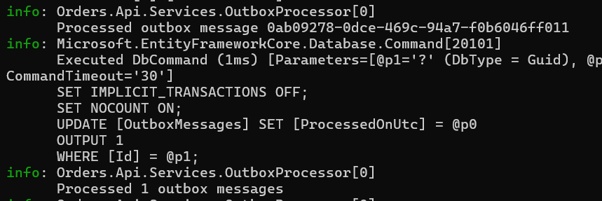

 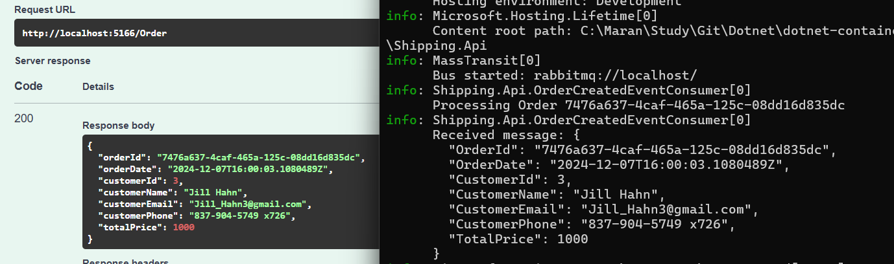

 ## Other Enhancement Consideration.

1. Incorporate a retry mechanism using packages like Polly to handle message publishing failures.

2. Ensure the message consumer is idempotent so that each order message is processed only once to create a shipment.

3. Separate the outbox message background service from Orders.Api into its own item.

4. Explore using HangFire as an alternative to BackgroundService.

5. Implement a strategy to archive successfully processed messages after a specified period.

6. Introduce a DeadLetter queue to manage unsuccessful messages.
