# Use dotnet Publish to create container image

This guide demonstrates how to use .NET's built-in container publishing capabilities to create and deploy Docker images to GitHub Container Registry (GHCR).

## Prerequisites

- .NET 7+ SDK
- Docker Desktop installed and running
- GitHub account with Personal Access Token (Classic)
- GitHub repository for your application

## Step 1: Build and Create Container Image

Create a container image directly from your .NET application:

```bash
# Build and create container image
dotnet publish --os linux -t:PublishContainer

# List available Docker images
docker images

# Run the container locally
docker run -d -p 3500:8080 productsapi

# Test the application
curl http://localhost:3500/products
```

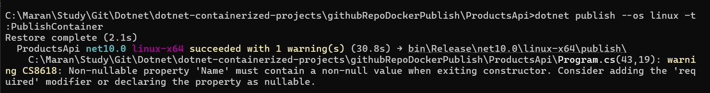

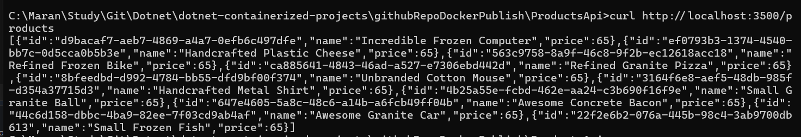

## Step 2: GitHub Container Registry Setup

### Generate Personal Access Token

1. Go to GitHub Settings → Developer settings → Personal access tokens → Tokens (classic)
2. Generate a new token with `write:packages` and `read:packages` permissions
3. Use the token for Docker login:

```bash
# Login to GitHub Container Registry
docker login ghcr.io -u <username> -p <githubTokenHere>
```

### Publish with Repository Configuration

```bash
# Build and configure for GitHub repository
dotnet publish --os linux -t:PublishContainer -p:ContainerRepository=productsapi -p:PrivateRepositoryUrl="https://github.com/r-manimaran/productsapi" -p:PublishRepositoryUrl=true
```

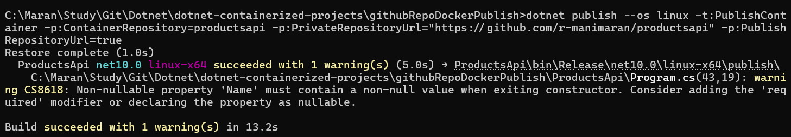

## Step 3: Inspect the Created Image

```bash
# Inspect the Docker image details
docker inspect productsapi
```

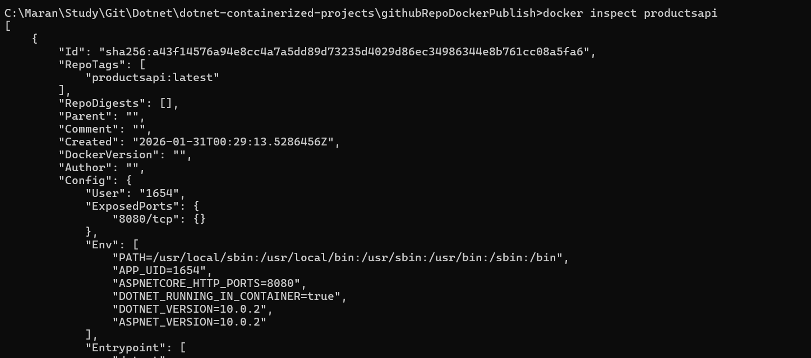

## Step 4: Tag and Push to GitHub Container Registry

### Tag the Image

```bash
# Tag the image for GitHub Container Registry
docker tag productsapi ghcr.io/r-manimaran/productsapi:latest

# List locally available images
docker images
```

### Push to Container Registry

```bash
# Push image to GitHub Container Registry
docker push ghcr.io/r-manimaran/productsapi:latest
```

## Step 5: Clean Up Local Images

```bash
# Remove local untagged image
docker rmi productsapi

# Remove the tagged image
docker rmi ghcr.io/r-manimaran/productsapi:latest

# Verify images are removed
docker images
```

## Step 6: Pull and Run from Registry

```bash
# Run container from GitHub Container Registry
# This will automatically pull the image if not available locally
docker run -d -p 3500:8080 ghcr.io/r-manimaran/productsapi:latest

# Verify the application is running
curl http://localhost:3500/products
```

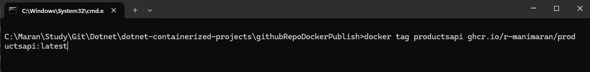

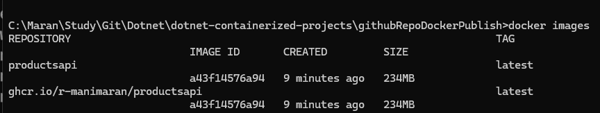

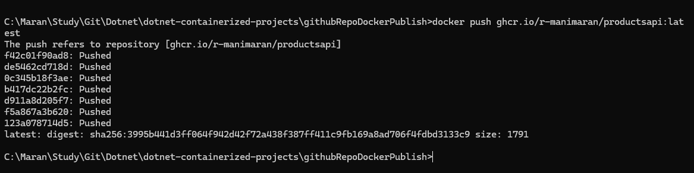

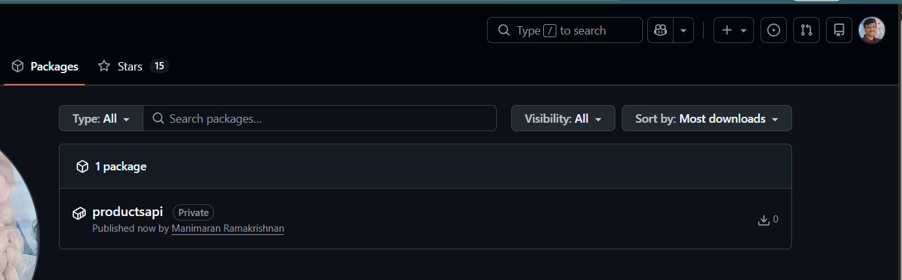

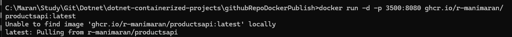

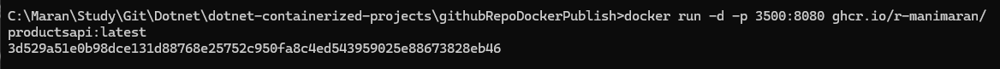

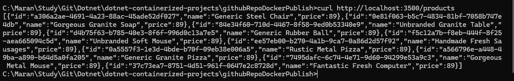

## Additional Commands

### Useful Docker Commands

```bash
# View running containers
docker ps

# Stop a running container
docker stop <container-id>

# View container logs
docker logs <container-id>

# Remove stopped containers
docker container prune

# Remove unused images
docker image prune
```

### .NET Container Publishing Options

```bash
# Specify custom image name and tag
dotnet publish --os linux -t:PublishContainer -p:ContainerImageName=myapp -p:ContainerImageTag=v1.0.0

# Set custom base image
dotnet publish --os linux -t:PublishContainer -p:ContainerBaseImage=mcr.microsoft.com/dotnet/aspnet:8.0

# Configure container registry
dotnet publish --os linux -t:PublishContainer -p:ContainerRegistry=ghcr.io -p:ContainerRepository=username/myapp
```

## Troubleshooting

- **Authentication Issues**: Ensure your GitHub token has the correct permissions (`write:packages`, `read:packages`)
- **Image Not Found**: Verify the image name and tag are correct
- **Port Conflicts**: Use a different port if 3500 is already in use: `-p 3501:8080`
- **Container Registry Access**: Make sure your repository visibility settings allow package access

## Security Best Practices

- Use specific image tags instead of `latest` in production
- Regularly update base images for security patches
- Store sensitive configuration in environment variables or secrets
- Use multi-stage builds to reduce image size and attack surface